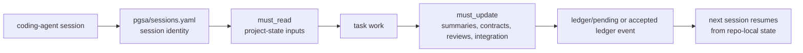
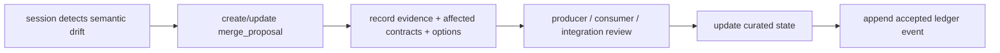

# PGSA Harness Core

[中文说明](README.zh-CN.md)

PGSA Harness Core is an agent-first, repo-local project-coherence protocol.
Version 1.2 keeps the core protocol file-based and embeddable, while adding a
review-first package-management layer for external skills/harnesses and an
optional Codex SDK runner for repeatable multi-session orchestration.

It is not a Python framework and it does not live inside any model. It lives in
a repository as files that coding agents can read, update, diff, review, and
carry across sessions.

## What It Is

Coding agents can complete local tasks while the project still drifts. A
backend session can change an API while a frontend session keeps the old
assumption. Docs can describe stale behavior. Local checks can pass while the
project no longer fits together.

PGSA makes that shared project state explicit:

```text
agent reads repo-local PGSA artifacts
-> agent performs the task
-> agent updates contracts, summaries, reviews, integration state, or ledger drafts
-> next agent continues from inspectable project state
```

The communication medium is the repository, not private chat history.

Use PGSA when work is long-running, split across agent sessions, or likely to
change shared assumptions. For small one-off edits, it may be unnecessary.

## Where It Lives In Your Project

PGSA is meant to be embedded inside an existing product or research repository.
Your main project code stays where it already is: `src/`, `app/`, `packages/`,
`docs/`, `tests/`, or any structure your project already uses. PGSA adds a
repo-local coordination layer beside that code:

```text
your-project/
  pgsa-harness/        # copied PGSA protocol + optional helper tools
  pgsa/                # this project's durable agent coordination state
  src/                 # your actual product code, unchanged
  tests/               # your existing tests
  docs/                # your existing docs
```

In this README, "your project repo" means the repository where you are doing the
real work. `pgsa-harness/` is the embedded protocol/tooling package. `pgsa/` is
the project-specific state that Codex, Claude Code, or other agents read and
update across sessions.

## File Model

The protocol source lives under `protocol/`:

- `protocol/SKILL.md`: the agent workflow.
- `protocol/artifact-map.md`: what each PGSA artifact means.
- `protocol/templates/`: starter artifacts copied into your project repo's `pgsa/` layer.
- `protocol/schemas/`: JSON schemas for structured artifacts.
- `protocol/rules/`: short boundaries agents should follow.
- `protocol/roles/`: optional role examples and role schemas.
- `protocol/capabilities/`: optional advanced capability packs.
- `protocol/adapters/`: optional adapter specifications for runtime/security/interpretability tools.

Inside your project repo, PGSA creates or maintains a `pgsa/` folder:

```text
pgsa/
  project.yaml
  sessions.yaml
  harness/
  contracts/
  state/
  merge_proposals/
  reviews/
  integration/
  ledger/
  imports/
    inbox/
    sources/
  reports/

  # optional advanced artifacts, created by init --advanced
  gates/
  runtime/
  skills/
  evidence/
  factory/
  scenarios/
  audits/
```

Core artifact roles:

| Artifact | Role |
| --- | --- |
| `project.yaml` | Project identity, goals, modules, and acceptance criteria. |
| `sessions.yaml` | Session identity, ownership, required reads, required updates, and handoff targets. |
| `harness/<session>.md` | Per-session operating instructions. |
| `contracts/*.json` | Shared producer/consumer assumptions, review state, acceptance tests, and breaking-change state. |
| `state/*.summary.md` | Compressed session memory plus recovery snapshot: scope, failed commands, touched files, open risks, and next action. |
| `merge_proposals/*.md` | Open semantic conflict records with evidence, options, and decision owner. |
| `reviews/*` | Review-gate status and blocking issues. |
| `integration/integration_report.json` | Current integration readiness, blockers, open merge proposals, and contract review state. |
| `ledger/coherence_ledger.jsonl` | Append-only accepted project-coherence events. |
| `ledger/pending/*.json` | Per-session event drafts for parallel runs, promoted by review/integration. |
| `imports/index.json` | External harness/skill/protocol import index, reviewed before activation. |
| `imports/inbox/` | Drop folder for external repos or skill packs before import processing. |
| `imports/sources/<source_id>/` | Optional copied external source material for repo-local review. |

Advanced mode is enabled explicitly:

```bash
PYTHONPATH=pgsa-harness/tools/python python3 -m pgsa_cli.main --root . init --advanced --force
PYTHONPATH=pgsa-harness/tools/python python3 -m pgsa_cli.main --root . validate --strict-advanced
```

Those optional folders are not the import system. They are built-in artifact
categories for richer project state:

| Advanced folder | Purpose |
| --- | --- |
| `gates/` | Verification blueprints and readiness gates. |
| `runtime/` | Runtime profiles and capability contracts. |
| `skills/` | Accepted skill provenance or signed skill manifests. |
| `evidence/` | Runtime or verification evidence records from external tools. |
| `factory/` | Factory-style task DAGs and planning artifacts. |
| `scenarios/` | Scenario tests and expected evidence. |
| `audits/` | Hypothesis-only cognitive audit notes. |

The import workflow is separate. External repositories, skill packs, prompt
packs, or protocol folders first go through `pgsa/imports/`. Only after review
should selected metadata or accepted provenance be promoted into advanced folders
such as `pgsa/skills/`.

## Built-In Packs Vs Project Import Packages

Keep bundled PGSA material separate from user-added external material:

| Location | Owner | Purpose |
| --- | --- | --- |
| `protocol/capabilities/`, `protocol/adapters/`, `protocol/templates/`, `protocol/schemas/` | PGSA harness | Shipped reference artifact shapes and optional advanced packs. |
| your project repo `pgsa/imports/inbox/` | user / importing agent | Temporary drop folder for external repos, skills, prompt packs, or docs. |
| your project repo `pgsa/imports/sources/<source_id>/` | project | Reviewable local copy of imported external material. |
| your project repo `pgsa/imports/index.json` | project | Import registry: source metadata, selected files, detected skills, review state, and triage session. |
| your project repo `pgsa/skills/` | project, advanced mode | Accepted skill provenance or signed skill manifests, not raw unreviewed imports. |

Raw external skills should not be mixed into the shipped `protocol/` folders.
They should
first enter `pgsa/imports/`, be reviewed by `external_import_review`
or a custom import-review session, and only then be promoted into project-owned
state such as `pgsa/skills/`, roles, contracts, capabilities, merge proposals,
or ledger events.

This is PGSA's package-management boundary. External skills, prompt packs,
harnesses, and reference protocols are treated as import packages: indexed,
copied, reviewed, and recorded before they can affect project state. The default
`external_import_review` session is the package-review session responsible for
triage. It is registered like any other PGSA session, with explicit
`must_read`, `must_update`, handoff, and ledger obligations.

## Core Workflow

Every agent session follows the same loop:

1. Read `pgsa/project.yaml`.
2. Read `pgsa/sessions.yaml`.
3. Identify the active session and inspect its `role`, `owner_scope`,
   `produces`, `consumes`, `must_read`, `must_update`, and `handoff_to`.
4. Read `pgsa/harness/<session>.md`.
5. Read relevant contracts, summaries, reviews, integration reports, merge
   proposals, and ledger events.
6. Do the task.
7. Update the affected PGSA artifacts before handoff.
8. If shared assumptions changed, update a contract or create a merge proposal.
9. If a decision was accepted, append a ledger event or submit a pending event
   for review.



## Session Handoff Snapshot

This is the practical "next-session recovery" mechanism. It does not mean PGSA
rolls back code or restores a filesystem snapshot. It means the next agent run
can recover the working context without replaying private chat history.

For that reason, each `pgsa/state/<session>.summary.md` should keep a short
handoff snapshot:

- current scope;
- last known good state;
- failed commands or checks that still matter;
- touched files, including files inspected or partially edited;
- open risks, blockers, or unresolved assumptions;
- next recommended action.

This handoff snapshot is intentionally smaller than a transcript. It gives the next
Codex, Claude Code, or human reviewer enough context to restart work, decide
what must be re-run, and avoid repeating failed commands.

## Multi-Session Registration

PGSA is registration-based. Each project session is declared in
`pgsa/sessions.yaml` with a role, ownership scope, produced artifacts, consumed
artifacts, required reads, required updates, handoff targets, and escalation
policy.

Example session identities:

```text
backend
  owns API contracts and backend summary

frontend_components
  consumes API contracts and owns UI review state

docs_security_integration
  reads contracts, summaries, reviews, merge proposals, integration state,
  and ledger before deciding readiness

external_import_review
  triages imported harnesses, skill packs, protocols, and docs before promotion
```

The registration tells Codex, Claude Code, or another coding-agent session what
it owns, what it must inspect, and what it must update before handoff.

PGSA includes a default active `external_import_review` session for import
triage. Agents can also register a new identity when the user asks for a custom
role:

```bash
PYTHONPATH=pgsa-harness/tools/python python3 -m pgsa_cli.main --root . session register research_import \
  --role external-skill-review \
  --scope "triage imported skills and protocols" \
  --must-read imports/index.json,imports/sources/ \
  --must-update state/research_import.summary.md,ledger/pending/ \
  --handoff-to docs_security_integration \
  --self-registered
```

This creates the `sessions.yaml` entry plus matching `harness/` and `state/`
files. The new session still has explicit scope and required artifacts; it does
not receive global authority over the repo.

### Session Agent Folders

The registry is still `pgsa/sessions.yaml`. A session agent folder is only a
launch wrapper for a fresh Codex, Claude Code, SDK, or external-agent session.
It gives that session its own `AGENTS.md` / `SKILL.md` while pointing back to the
same PGSA root, harness root, required reads, required updates, and accepted
skill manifest.

Default embedded layout:

```bash
PYTHONPATH=pgsa-harness/tools/python python3 -m pgsa_cli.main --root . session-agent create backend
```

This writes:

```text
pgsa/session_agents/backend/
  AGENTS.md
  SKILL.md
  PGSA_SESSION.json
```

For a sibling long-running session folder or separate worktree:

```bash
PYTHONPATH=pgsa-harness/tools/python python3 -m pgsa_cli.main --root target-project \
  session-agent create backend \
  --out ../agent-sessions/backend \
  --harness-root ../pgsa-harness
```

The generated `PGSA_SESSION.json` stores relative pointers to `pgsa_root`,
`harness_root`, `sessions.yaml`, `harness/<session>.md`,
`state/<session>.summary.md`, and `skills/signed_skill_manifest.yaml`.

Accepted external skills are reusable across sessions through
`pgsa/skills/signed_skill_manifest.yaml`: a session should use only entries
whose `applies_to` contains that session id or `*`. Raw
`pgsa/imports/sources/<source_id>/` content remains review material, not active
guidance, unless the session is `external_import_review` or the source is
explicitly listed in `must_read`.

## External Skill And Harness Package Management

External harnesses, skills, prompt packs, protocol folders, or docs should be
managed as reviewable packages before a session uses them.

For direct import:

```bash
PYTHONPATH=pgsa-harness/tools/python python3 -m pgsa_cli.main --root . import add external_pack \
  --path ../external-pack \
  --kind skill_pack \
  --session external_import_review
```

For the inbox workflow, copy or clone external sources into
`pgsa/imports/inbox/`, then process the inbox:

```bash
cp -R ../external-pack pgsa/imports/inbox/external_pack
PYTHONPATH=pgsa-harness/tools/python python3 -m pgsa_cli.main --root . import process-inbox
PYTHONPATH=pgsa-harness/tools/python python3 -m pgsa_cli.main --root . import review external_pack
PYTHONPATH=pgsa-harness/tools/python python3 -m pgsa_cli.main --root . import promote external_pack --accept-import --applies-to backend,frontend_components
PYTHONPATH=pgsa-harness/tools/python python3 -m pgsa_cli.main --root . import stats
```

`process-inbox` indexes each inbox item, copies it into
`pgsa/imports/sources/<source_id>/`, records it in `pgsa/imports/index.json`,
and clears the processed inbox item by default. Pass `--keep` only when you are
debugging.

`import review <source_id>` is the review step. It scans the copied source for
`SKILL.md`, README, and schema files, updates the import record to `reviewed`,
and writes the result into `harness/<session>.md`,
`state/<session>.summary.md`, and `ledger/pending/`. It still does not install
or trust the imported content automatically.

`import promote <source_id> --accept-import` is the accepted-provenance step.
It writes reviewed skill metadata into `pgsa/skills/signed_skill_manifest.yaml`
and marks the import accepted. It still does not install global skills, execute
imported code, or copy raw external instructions into the shipped `protocol/`
folders.

Use `--applies-to` to make accepted provenance available to later sessions. For
example, one imported package can be approved for `backend`,
`frontend_components`, and `docs_security_integration` without giving it global
authority over the project.

The import command records source kind, origin path, optional local copy,
selected files, file count, total bytes, detected skill entries, review
artifacts, and the recommended triage session in `pgsa/imports/index.json`.

The intended flow is review-first package management:

1. Place or copy the external source into `pgsa/imports/inbox/`.
2. Let `external_import_review` or another import-review session process it.
3. Let that session read `imports/index.json` and the reviewed
   `imports/sources/<source_id>/`.
4. Run `pgsa import review <source_id>` or have the session write the same
   review artifacts manually.
5. Run `pgsa import promote <source_id> --accept-import --applies-to <sessions>` when accepted skill
   provenance should enter `pgsa/skills/signed_skill_manifest.yaml`.
6. Promote only accepted material into contracts, summaries, roles, capability
   manifests, `pgsa/skills/`, merge proposals, or ledger events.

Imported content is source material, not trusted project guidance. This keeps
external skills from silently changing the project contract or overriding
current PGSA state.

Dedicated import-review configuration:

- `pgsa/sessions.yaml` includes `external_import_review` by default.
- `pgsa/harness/external_import_review.md` is generated at init time as the
  session operating file.
- `protocol/imports/external_import_review_agent.md` contains the launch prompt
  and step-by-step review workflow.
- `protocol/roles/examples/external-import-review.role.yaml` is the role
  example for custom projects that want a stronger import-review role file.

To run a real external import verification against public skill sources:

```bash
python3 tools/scripts/verify_external_skill_imports.py
```

The script clones external skills into a temporary project, drops them into
`pgsa/imports/inbox/`, runs `process-inbox`, runs `import review`, verifies that
the inbox was cleaned, checks review artifacts and pending ledger events, and
runs `pgsa validate`.

## Conflict Lifecycle And Ledger Boundary

PGSA does not silently auto-merge conflicting writes, and it is not a PR merge
agent. Git, PRs, CI, and code review remain the right tools for code diffs,
textual conflicts, implementation review, and final merge.

PGSA works one layer earlier: it records cross-session project semantics that
may not appear as a Git conflict.

Conflict lifecycle:



Boundary:

| Layer | Files | Meaning |
| --- | --- | --- |
| Current curated state | `sessions.yaml`, `contracts/`, `state/`, `merge_proposals/`, `reviews/`, `integration/` | Editable project state: roles, assumptions, open conflicts, review state, and integration readiness. |
| Pending history | `ledger/pending/*.json` | Draft event records from parallel sessions, not yet accepted. |
| Accepted history | `ledger/coherence_ledger.jsonl` | Append-only timeline of accepted project-coherence events and decisions. |

When a session detects semantic drift, such as a contract changing while a
consumer still holds the old assumption, it writes or updates
`pgsa/merge_proposals/*.md` with evidence, affected contracts, resolution
options, and a decision owner.

Only after review or integration accepts the resolution should the project append
an event to `pgsa/ledger/coherence_ledger.jsonl`. The ledger should reference
the curated artifacts; it should not become a dumping ground for raw context,
unaccepted conclusions, or full chat transcripts.

For parallel runs, sessions should write `pgsa/ledger/pending/*.json` first. The
review/integration session promotes accepted events into the coherence ledger.

## Why This Is Not PR Automation

PGSA is not trying to replace pull requests. PRs are still the right place to
review a code diff, run CI, discuss implementation, and merge changes.

PGSA records the project-state that coding-agent sessions need before a PR is
ready:

- which session owns which part of the project;
- which contracts and summaries must be read before editing;
- which artifacts must be updated before handoff;
- which semantic assumptions changed even when Git has no text conflict;
- why integration is ready or blocked.

The main advantage over plain PR review is semantic continuity. A backend
session can change an API in a way that still compiles, while a frontend session
keeps the old assumption. Git may not conflict and a PR may not expose the drift
until late review. PGSA records that drift as repo-local project state so the
next agent does not depend on private chat history.

## Quick Start

Copy `pgsa-harness/` into your existing project repo as a normal folder:

```text
your-project/
  pgsa-harness/
  pgsa/
  src/
  tests/
```

The agent-facing protocol is `pgsa-harness/protocol/SKILL.md`. Your project's
durable coordination state is `pgsa/`.

Optional initialization and validation can run from the embedded folder without
global installation:

```bash
PYTHONPATH=pgsa-harness/tools/python python3 -m pgsa_cli.main --root . init --force
PYTHONPATH=pgsa-harness/tools/python python3 -m pgsa_cli.main --root . validate
PYTHONPATH=pgsa-harness/tools/python python3 -m pgsa_cli.main --root . export-context --session backend
```

Advanced artifacts are optional:

```bash
PYTHONPATH=pgsa-harness/tools/python python3 -m pgsa_cli.main --root . init --advanced --force
PYTHONPATH=pgsa-harness/tools/python python3 -m pgsa_cli.main --root . validate --strict-advanced
```

Python is intentionally outside the main path. The protocol is the files.

## Codex And Claude Code Use

For Codex, put PGSA guidance in your project repo's `AGENTS.md`. For Claude
Code, put the equivalent guidance in `CLAUDE.md`; this repository includes both
files as examples.

Minimal Codex prompt:

```text
Use PGSA session backend. Read AGENTS.md, pgsa-harness/protocol/SKILL.md,
pgsa/sessions.yaml, and the backend must_read artifacts before editing. Work
inside the backend owner_scope unless a merge proposal is needed. Update backend
must_update artifacts before handoff.
```

Minimal Claude Code prompt:

```text
Use PGSA session frontend_components. Read CLAUDE.md,
pgsa-harness/protocol/SKILL.md, pgsa/sessions.yaml, and the frontend_components
must_read artifacts before editing. If UI assumptions no longer match a
contract, create or update a merge proposal instead of relying on conversation
memory.
```

Multiple sessions can run from separate terminals, separate worktrees, or
separate agent threads. Give each one a distinct PGSA identity:

```bash
codex "Use PGSA session backend. Read AGENTS.md, pgsa-harness/protocol/SKILL.md, pgsa/sessions.yaml, and the backend must_read artifacts. Update backend must_update artifacts before handoff."

codex "Use PGSA session frontend_components. Read AGENTS.md, pgsa-harness/protocol/SKILL.md, pgsa/sessions.yaml, frontend_components must_read artifacts, and backend contract state. Update frontend must_update artifacts before handoff."

codex "Use PGSA session docs_security_integration. Read AGENTS.md, pgsa-harness/protocol/SKILL.md, all summaries, reviews, contracts, merge proposals, integration state, and ledger. Decide readiness and block integration if unresolved semantic drift remains."
```

Claude Code can be launched the same way with `claude "Use PGSA session ..."`.

For Codex subagent workflows, keep the parent session as the integrator and ask
subagents to return PGSA-ready summaries instead of writing every artifact
directly.

## Native Codex Vs Codex SDK

The default path is native Codex or Claude Code use inside your project folder.
Open the agent in `your-project/`, give it a PGSA session identity, and tell it
to read `AGENTS.md` or `CLAUDE.md`, `pgsa-harness/protocol/SKILL.md`,
`pgsa/sessions.yaml`, and that session's `must_read` artifacts. The agent then
updates its `must_update` artifacts before handoff.

Use the SDK only when you want to programmatically start the same registered
sessions in a repeatable way. The SDK does not create better memory than the
file protocol. It is a launcher/orchestrator over the same `pgsa/` files.

## Optional Codex SDK Demo

The optional `sdk/` folder is for users who already want to run PGSA sessions
through the Codex SDK. It is a userland demo, not the core PGSA path and not an
OpenAI endorsement or integration claim. The SDK reference is
<https://developers.openai.com/codex/sdk#python-library>.

PGSA supports two Codex usage modes:

| Mode | How it works | Best for | Tradeoff |
| --- | --- | --- | --- |
| Native Codex / no SDK | Start Codex manually in your project repo and give it a PGSA session prompt, for example `Use PGSA session backend...`. Codex reads `AGENTS.md`, `protocol/SKILL.md`, and `pgsa/` artifacts directly. | Normal interactive work, one-off sessions, manual control, and maximum transparency. | The user starts and coordinates each session manually. |
| Codex SDK | `sdk/codex_pgsa_runner.py` reads `pgsa/sessions.yaml`, builds one PGSA-aware prompt per session, starts Codex SDK threads in the project repo passed by `--root`, and asks each thread to update `must_update` artifacts. | Programmatic orchestration, repeated long-running checks, CI/internal tools, and launching multiple registered sessions consistently. | Requires the optional Codex SDK and remains userland orchestration; PGSA still does not bypass Codex sandboxing or approvals. |

The SDK advantage is repeatability. It turns the same repo-local PGSA session
registry into consistent Codex thread starts, while the non-SDK path remains the
plain file/protocol workflow for everyday interactive use.

```bash
python3 sdk/codex_pgsa_runner.py --root . --config sdk/codex-runner.config.example.json --dry-run
```

SDK flow:

1. Initialize PGSA in your project repo.
2. Check `pgsa/sessions.yaml` and make sure each session has a role,
   `must_read`, and `must_update`.
3. Run the SDK dry-run to inspect the prompts it would start.
4. Install the official SDK separately.
5. Start threads with `--start-only`, or run the configured session prompts.

```bash
PYTHONPATH=pgsa-harness/tools/python python3 -m pgsa_cli.main --root . init --force
python3 sdk/codex_pgsa_runner.py --root . --config sdk/codex-runner.config.example.json --dry-run
pip install openai-codex
python3 sdk/codex_pgsa_runner.py --start-only
python3 sdk/codex_pgsa_runner.py --root . --config sdk/codex-runner.config.example.json
```

The runner reads `pgsa/sessions.yaml`, builds one PGSA-aware prompt per
registered session, starts each Codex SDK thread in the project repo root passed
by `--root`, and asks each thread to update its `must_update` artifacts
before handoff. It stays userland orchestration: PGSA remains the file protocol,
and Codex sandboxing/approvals remain Codex's responsibility. For temporary
verification runs, set `"ephemeral": true` in the SDK config; leave it `false`
when SDK-run sessions should remain resumable.

## Optional Python Tools

The optional CLI can initialize and validate PGSA artifacts for users:

```bash
python3 -m pip install -e tools/python
pgsa --root examples/teamtask-projectboard validate
pgsa --root examples/teamtask-projectboard drift-report
pgsa --root /tmp/pgsa-demo init --force
```

Without installing:

```bash
PYTHONPATH=tools/python python3 -m pgsa_cli.main --root examples/teamtask-projectboard status
```

For convenience, `--root` is accepted before or after the subcommand:

```bash
pgsa --root examples/teamtask-projectboard validate
pgsa validate --root examples/teamtask-projectboard
```

The CLI is helper automation. It does not decide semantic truth, resolve merge
conflicts, or replace agent judgment.

## What v1.2 Adds

Version 1.2 builds on the v1.1 protocol/advanced-pack baseline by formalizing
two practical usage layers: optional Codex SDK orchestration and review-first
external skill/harness package management.

Compared with the v1.1 baseline:

| v1.1 baseline | v1.2 improvement |
| --- | --- |
| Core protocol plus optional advanced packs. | External skill/harness package management through `imports/inbox/`, `imports/sources/`, `imports/index.json`, and the dedicated `external_import_review` session. |
| Agents could read PGSA files manually. | Concrete non-SDK prompts plus an optional Codex SDK runner that starts registered PGSA sessions repeatably from `pgsa/sessions.yaml`. |
| Imported material could be referenced by convention. | Imported packages are copied, indexed, reviewed, summarized, promoted into accepted skill provenance when approved, and recorded in pending ledger events before project activation. |
| Skill provenance existed as an advanced artifact shape. | Accepted import metadata can be promoted into `pgsa/skills/`; raw unreviewed external content stays out of shipped `protocol/`. |
| Recovery and conflict artifacts existed. | README now documents the daily-use path: recovery snapshots, `must_read`/`must_update`, semantic conflicts, ledger boundaries, SDK vs non-SDK use, and import-package review. |

The v1.2 package-management path is intentionally narrow:

```text
external source
-> pgsa/imports/inbox/
-> pgsa import process-inbox
-> pgsa/imports/sources/<source_id>/ + imports/index.json
-> external_import_review session
-> review artifacts + ledger/pending/
-> pgsa import promote <source_id> --accept-import --applies-to <sessions>
-> accepted provenance in pgsa/skills/signed_skill_manifest.yaml
-> optional promotion into contracts, roles, capabilities, or ledger
```

The underlying v1.1 advanced areas remain:

| Area | Files | What it adds |
| --- | --- | --- |
| Session registry | `pgsa/sessions.yaml` | Clear session identity, ownership, `must_read`, `must_update`, handoff, and escalation rules. |
| Semantic conflicts | `pgsa/merge_proposals/` | Reviewable records for assumption drift that may not appear as a Git conflict. |
| Verification planning | `pgsa/gates/`, `pgsa/scenarios/` | Verification blueprints and scenario tests that describe what evidence should exist before integration. |
| Review routing | `pgsa/reviews/` | Risk-aware review-routing artifacts for deciding who or what should inspect a change. |
| Runtime evidence | `pgsa/runtime/`, `pgsa/evidence/` | Records from external runtime/security tools without claiming PGSA enforces runtime policy itself. |
| Capability contracts | `pgsa/runtime/` | Explicit capability and approval expectations for sessions or tools. |
| Signed skills | `pgsa/skills/` | Optional skill provenance records, digests, and trust metadata. |
| Factory-style planning | `pgsa/factory/` | Task DAGs and decomposition plans; not an autonomous factory or hosted orchestrator. |
| Cognitive audit notes | `pgsa/audits/` | Hypothesis-only research notes; not model interpretability evidence by itself. |

All advanced packs are optional. They are repo-local artifact shapes, not
services, daemons, CI, sandboxing, merge automation, or security enforcement.

## Layers

Advanced packs are organized as optional layers so PGSA remains a project-state
protocol:

| Layer | Status | Purpose |
| --- | --- | --- |
| Core protocol | Required, stable | Project contracts, sessions, state, reviews, integration, ledger, and merge proposals. |
| Advanced packs | Optional, draft | Verification, scenario, review-routing, runtime evidence, signed skills, and factory-style planning artifacts. |
| Runtime adapters | Specs only | Interfaces for external tools that may provide runtime/security evidence. |
| Research notes | Hypothesis only | Cognitive audit notes and related observations; never stronger than tests, runtime evidence, contracts, or review decisions. |

Advanced schemas intentionally describe artifact shapes and references. They do
not make PGSA enforce runtime policy by itself.

## Example

`examples/teamtask-projectboard/` contains a complete PGSA artifact layer. Start
there to see the file model without reading implementation code.

## Boundaries

PGSA does not replace PRs, worktrees, tests, code review, CI, security tooling,
sandboxing, or integration agents. It adds a repo-local project-state layer that
makes cross-session assumptions visible and recoverable.

PGSA Harness Core v1.2 is a local protocol release. Advanced packs and import
package management are optional project-state files and workflows, not mandatory services. Current evidence is local
architecture-protocol and embedded-example evidence only. It is not a Codex,
Claude Code, Grok, OpenAI, Anthropic, or hosted-product benchmark.

## License

Apache License 2.0. See `LICENSE`.
