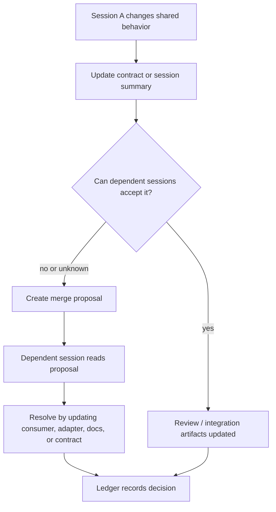

# PGSA Harness Core

[中文说明](README.zh-CN.md)

PGSA Harness Core is a repo-local project-coherence layer for coding-agent workflows.

It is harness-first and file-first. It does not live inside the model. It lives
inside the repository.

Codex-style, Claude Code-style, Grok Build-style, and generic CLI agents can
read it, write to it, and use it as a workflow layer for:

- contracts;
- session summaries;
- semantic merge proposals;
- review state;
- integration reports;
- coherence ledger events;
- drift reports.

The primary surface is `AGENTS.md`, `.codex/`, `.agents/skills/`, `skills/`,
`commands/`, `hooks/`, `templates/`, `rules/`, and repo-local `pgsa/`
artifacts. The Python CLI is optional helper automation, not the protocol
itself.


PGSA does not replace PRs or worktrees. It adds a repo-local
project-coherence layer across long-running coding-agent sessions.

The generated project surface is a `pgsa/` folder made of readable project artifacts:

- session harness files;
- contracts;
- session summaries;
- semantic merge proposals;
- review gates;
- integration reports;
- coherence ledger events;
- drift reports.

The Python code only initializes, validates, packages, and summarizes repo-local artifacts. The protocol remains visible in Markdown, JSON, YAML-shaped files, and JSONL.

PGSA Harness Core v0.1 is experimental. It is not a Codex, Claude Code, Grok, OpenAI, Anthropic, or hosted product benchmark.

## Core Idea

Coding agents can finish local tasks while the project still drifts.

A backend session can change an API. A frontend session can keep the old assumption. Docs can describe stale behavior. Local checks can pass while the project no longer fits together.

PGSA makes the shared project state explicit before the next session has to reconstruct it from memory.

The key sentence:

```text
PGSA Harness does not live inside Codex. It lives inside the repo. Codex reads it, writes to it, and uses it as a project-coherence workflow layer.
```

## What Gets Created

`pgsa init` creates this protocol layer inside a target repo:

```text
pgsa/
  project.yaml
  sessions.yaml
  harness/
    backend.md
    frontend_components.md
    docs_security_integration.md
  contracts/
    api.project.v1.json
  state/
    backend.summary.md
    frontend_components.summary.md
    docs_security_integration.summary.md
  merge_proposals/
  reviews/
  integration/
    integration_report.json
  ledger/
    coherence_ledger.jsonl
  reports/
```

The most important files are the session harness files under `pgsa/harness/`. They tell each session what it owns, what it must update, and how to record conflicts.

## Repository Layout

This repo is organized as an agent harness, not only as a CLI package:

- `AGENTS.md`: root instructions for coding agents working in this repository.
- `.codex/`: Codex-style workflow notes, prompts, and examples.
- `.claude/`: Claude Code-style workflow notes, command notes, and hook notes.
- `.opencode/`: generic/OpenCode-style workflow notes.
- `.agents/skills/pgsa/`: runtime-neutral PGSA skill package.
- `skills/`: tool-specific skill bundles for Codex-style and Claude Code-style workflows.
- `adapters/`: adapter notes for Codex, Claude Code, Grok Build, and generic CLI workflows.
- `commands/`: command-style prompts for session start, contract update, merge proposal, review gate, integration check, and drift report.
- `hooks/`: lifecycle hook examples for session start, post tool use, and stop checks. They are examples and are not auto-enabled.
- `templates/`: public-facing PGSA artifact templates copied into a target repo's `pgsa/` layer.
- `rules/`: short claim and workflow boundaries that agents can read quickly.
- `roles/`: project-defined role examples and schemas. The example roles are not fixed PGSA requirements.
- `assets/`: public README and release images.
- `scripts/`: install, smoke-test, release-validation, and packaging helpers.
- `pgsa_cli/`: optional Python CLI entrypoint.
- `core/`: schemas, templates, validators, metrics, and context export implementation.
- `examples/`: lightweight PGSA artifact example project.
- `tests/`: standard-library smoke tests for the CLI and example project.
- `docs/`: architecture, lifecycle, concept, evidence, and claim-boundary notes.

## How Agents Use PGSA

Agents use PGSA by reading and writing repo-local artifacts:

1. Read `AGENTS.md`.
2. Identify the active session in `pgsa/sessions.yaml`.
3. Read `pgsa/harness/<session>.md`.
4. Read relevant contracts, summaries, merge proposals, reviews, integration
   reports, and ledger events.
5. Do the local task.
6. Update the PGSA artifacts affected by the task.
7. Run validation and drift reporting where relevant.

Agents can use Codex, Claude Code, generic CLI, or other execution surfaces.
PGSA is the project-coherence layer around those surfaces.

## Codex Workflows

Codex-style workflows should start from `.codex/README.md` or
`skills/codex/SKILL.md`. Codex reads PGSA artifacts, updates contracts and
summaries, creates merge proposals when needed, and records ledger events.

PGSA does not live inside Codex and does not modify Codex internals.

## Claude Code Workflows

Claude Code-style workflows can use `.claude/`, `skills/claude-code/`, and
`adapters/claude-code/` as workflow notes. Hooks are examples only and are not
auto-enabled.

Claude Code sessions should still write the same repo-local PGSA artifacts.

## Roles And Sessions

PGSA roles are project-defined. The example frontend/backend/docs/security
roles are only examples.

A project can define its own roles under `roles/`, bind them to sessions in
`pgsa/sessions.yaml`, and connect them to Codex, Claude Code, or generic agent
surfaces.

See `docs/custom-session-roles.md` and
`docs/role-binding-and-external-harness.md`.

## PGSA, PRs, And Worktrees

PGSA is not a PR replacement and not a worktree replacement.

```text
PR asks: can this diff merge?
PGSA asks: does the project still make sense after multiple sessions changed it?
```

PGSA can operate before, during, or above PR/worktree workflows.

See `docs/pgsa-vs-pr-gittree.md`.

## How Sessions Communicate

PGSA does not require two agents to talk to each other directly.

The communication mechanism is the repository itself:

1. `pgsa/sessions.yaml` defines durable session ownership.
2. `pgsa/harness/<session>.md` gives each session its operating instructions.
3. `pgsa/contracts/*.json` records shared API, schema, component, permission, or documentation expectations.
4. `pgsa/state/*.summary.md` records what each session changed and what it believes is true.
5. `pgsa/merge_proposals/*.md` records semantic conflicts between sessions.
6. `pgsa/reviews/` and `pgsa/integration/` record whether dependent areas accepted the change.
7. `pgsa/ledger/coherence_ledger.jsonl` gives the project an append-only memory of important project-coherence events.

This is the key conflict-resolution mechanism: when a session changes shared assumptions, it must update the contract or create a merge proposal. The next session reads those repo-local artifacts instead of relying on chat history.



## Why Export Session Context

`export-context` is not the communication mechanism. The communication mechanism is the `pgsa/` artifact layer.

`export-context` is only a convenience command. It assembles the relevant session harness, contracts, summary, recent ledger events, and current drift report into one Markdown packet so an agent can start with the right project state.

You can skip `export-context` and read the files manually. The protocol still works.

## Conflict Boundary

PGSA does not automatically solve every conflict.

It makes project conflicts explicit, reviewable, and resumable through
contracts, summaries, merge proposals, review gates, integration reports, and
ledger events.

See `docs/conflict-lifecycle.md`.

## Quick Start

If your system does not provide a `python` command, use `python3` in the same commands.

```bash
mkdir demo-project
python -m pgsa_cli.main --root demo-project init
python -m pgsa_cli.main --root demo-project validate
python -m pgsa_cli.main --root demo-project drift-report
python -m pgsa_cli.main --root demo-project harness --session backend
python -m pgsa_cli.main --root demo-project export-context --session backend --output backend_context.md
```

Installed CLI form:

```bash
python -m venv .venv
python -m pip install -e .
pgsa --root demo-project validate
pgsa --root demo-project drift-report
```

## Commands

- `init`: create the repo-local PGSA artifact layer.
- `validate`: check required artifacts and obvious structural issues.
- `drift-report`: write `pgsa/reports/drift_report.json`.
- `watch`: run a one-shot status check; this is not a background supervisor.
- `queue list`: list optional `pgsa/tasks/queue.json` items; queue is not the session communication mechanism.
- `harness --session <name>`: print a session's harness Markdown.
- `export-context --session <name>`: print or write a session context packet.
- `continuation-prompt --session <name>`: generate a focused continuation prompt from current drift.
- `session start/update`: append session lifecycle events and update summaries.
- `contract diff`: show contract-related validation issues.
- `integration check`: show integration blockers.
- `merge propose`: create a semantic merge proposal.

## Agent Harness Entry Points

- Codex-style workflow: read `.codex/README.md` and `skills/codex/SKILL.md`.
- Runtime-neutral workflow: read `.agents/skills/pgsa/SKILL.md`.
- Claude Code-style workflow: read `skills/claude-code/SKILL.md`.
- Command-style workflow: use prompts in `commands/`.
- Hook-style workflow: adapt examples in `hooks/` only when a user explicitly enables local hooks.

## Why There Are Still Python Files

The protocol is the `pgsa/` artifacts.

The Python files are helper automation:

- `pgsa_cli/main.py`: entrypoint for `python -m pgsa_cli.main`.
- `pgsa_cli/cli.py`: wires `init`, `validate`, `harness`, `export-context`, `drift-report`, `watch`, `queue list`, and related commands to the core functions.
- `core/io.py`: reads and writes JSON, JSONL, and JSON-compatible YAML files.
- `core/templates/defaults.py`: stores the default project, sessions, contract, summary, harness, review, and integration templates.
- `core/templates/initializer.py`: powers `pgsa init` by creating the repo-local `pgsa/` artifact layer.
- `core/validators/artifacts.py`: powers `pgsa validate` by checking required artifacts, contract shape, unresolved merge proposals, and integration blockers.
- `core/metrics/drift.py`: powers `pgsa drift-report` by turning validation issues into drift and maintainability reports.
- `core/supervisor/context.py`: reads `pgsa/harness/<session>.md` and optionally exports a single-session context packet.
- `scripts/*.py`: release and local-adoption helper scripts.
- `tests/*.py`: standard-library smoke tests.
- The `__init__.py` files only make these folders importable Python packages.

Users do not need to edit these Python files. They use the generated Markdown/JSON/YAML artifacts.

In other words, Python is not the protocol surface. It only automates creating and checking the `pgsa/` files. The minimal manual workflow can still be direct edits to `pgsa/harness/*.md`, `pgsa/contracts/*.json`, `pgsa/state/*.summary.md`, and `pgsa/merge_proposals/*.md`.

### What Does The CLI Do?

The CLI helps initialize, validate, export, and summarize repo-local PGSA
artifacts.

It does not replace review or integration agents. It does not decide semantic
truth. It is helper automation for the harness.

See `docs/cli-boundary.md`.

## When Not To Use PGSA

PGSA is usually too heavy for trivial one-file edits, throwaway scripts,
isolated experiments, and tasks with no cross-session project risk.

Use PGSA when contracts, session state, semantic conflicts, review state, or
integration readiness matter.

## Level 3 Roadmap

Product-level claims require real tool runs: prompts, commands, transcripts,
diffs, tests, versions, timing, and a shared evaluator. Until that exists, PGSA
claims stay at the local architecture-protocol level.

## Evidence Boundary

Current evidence is local generated git-worktree architecture-protocol evidence only.

Supported narrow claim:

```text
In local generated git-worktree suites, PGSA-gated artifacts surfaced semantic contract drift as review / merge blockers while not over-blocking the included no-drift controls.
```

This is not a Codex / Claude / Grok product benchmark.

Product-level claims require real tool commands, prompts, transcripts, diffs, tests, timing, versions, and the same evaluator across conditions.

## License

PGSA Harness Core is licensed under the Apache License 2.0. See `LICENSE`.

## FAQ

### Are PGSA roles fixed?

No. Roles are project-defined. The example roles are only examples.

### Is PGSA just PR?

No. PR reviews a code diff. PGSA tracks project-state transactions across
sessions.

### Is PGSA just Git worktree or GitTree?

No. Worktrees isolate execution. PGSA tracks contracts, session state, semantic
conflicts, review state, and integration readiness.

### Does PGSA automatically solve conflicts?

No. It makes project conflicts explicit, reviewable, and resumable.

### What does the CLI actually do?

It initializes, validates, exports, and summarizes artifacts. It is helper
automation, not semantic authority.

### How do subagents fit?

Subagents are internal to sessions. Session owners synthesize subagent work into
project-level artifacts. PGSA models this handoff, but v0.1 does not implement a
subagent scheduler.

### When is PGSA too heavy?

For trivial one-file edits, throwaway scripts, isolated experiments, or tasks
with no cross-session project risk.
