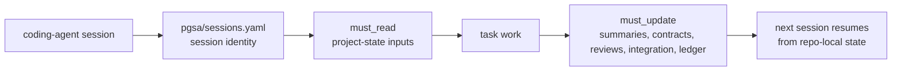
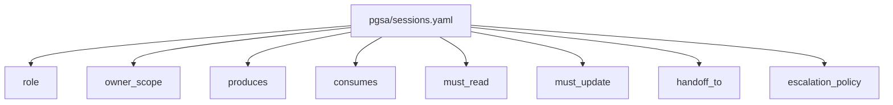
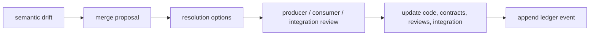

# PGSA Harness Core

[中文说明](README.zh-CN.md)

PGSA Harness Core is an agent-first, repo-local project-coherence protocol. Version 1.1 adds optional advanced capability packs while keeping the core protocol file-based and embeddable.

It is not a Python framework and it does not live inside any model. It lives in a
repository as files that coding agents can read, update, diff, review, and carry
across sessions.

## What PGSA Does

Coding agents can finish local tasks while the project still drifts. A backend
session can change an API while a frontend session keeps the old assumption.
Docs can describe stale behavior. Local checks can pass while the project no
longer fits together.

PGSA makes that shared project state explicit:

```text
agent reads repo-local PGSA artifacts
-> agent performs the task
-> agent updates contracts, summaries, reviews, integration state, or ledger
-> next agent continues from inspectable project state
```

The communication medium is the repository, not chat history.



## Core Files

The protocol source lives under `protocol/`:

- `protocol/SKILL.md`: the agent workflow.
- `protocol/artifact-map.md`: what each PGSA artifact means.
- `protocol/templates/`: starter artifacts copied into a target repo's `pgsa/` layer.
- `protocol/schemas/`: JSON schemas for structured artifacts.
- `protocol/rules/`: short boundaries agents should follow.
- `protocol/roles/`: optional role examples and role schemas.
- `protocol/capabilities/`: optional advanced capability packs.
- `protocol/adapters/`: optional adapter specifications for runtime/security/interpretability tools.

A target project using PGSA has a `pgsa/` folder:

```text
pgsa/
  project.yaml
  sessions.yaml
  harness/
  contracts/
  state/
  merge_proposals/
  reviews/
  integration/
  ledger/
  reports/

  # optional advanced mode
  gates/
  runtime/
  skills/
  evidence/
  factory/
  scenarios/
  audits/
```

## What v1.1 Adds

Version 1.1 keeps the core protocol small, but adds optional project-state
layers for teams that want more than session summaries and contracts:

| Area | Files | What it adds |
| --- | --- | --- |
| Session registry | `pgsa/sessions.yaml` | Clear session identity, ownership, `must_read`, `must_update`, handoff, and escalation rules. |
| Semantic conflicts | `pgsa/merge_proposals/` | Reviewable records for assumption drift that may not appear as a git conflict. |
| Verification planning | `pgsa/gates/`, `pgsa/scenarios/` | Verification blueprints and scenario tests that describe what evidence should exist before integration. |
| Review routing | `pgsa/reviews/` | Risk-aware review-routing artifacts for deciding who or what should inspect a change. |
| Runtime evidence | `pgsa/runtime/`, `pgsa/evidence/` | Records from external runtime/security tools without claiming PGSA enforces runtime policy itself. |
| Capability contracts | `pgsa/runtime/` | Explicit capability and approval expectations for sessions or tools. |
| Signed skills | `pgsa/skills/` | Optional skill provenance records, digests, and trust metadata. |
| Factory-style planning | `pgsa/factory/` | Task DAGs and decomposition plans; not an autonomous factory or hosted orchestrator. |
| Cognitive audit notes | `pgsa/audits/` | Hypothesis-only research notes; not model interpretability evidence by itself. |

All advanced packs are optional. They are repo-local artifact shapes, not
services, daemons, CI, sandboxing, merge automation, or security enforcement.

The important loop is:

1. Read `pgsa/project.yaml`.
2. Read `pgsa/sessions.yaml`.
3. Pick the active session and inspect its `role`, `produces`, `consumes`,
   `must_read`, `must_update`, and `handoff_to` fields.
4. Read `pgsa/harness/<session>.md`.
5. Read relevant contracts, summaries, reviews, integration reports, merge proposals, and ledger events.
6. Do the task.
7. Update the affected PGSA artifacts before handoff.
8. If shared assumptions changed, update a contract or create a merge proposal.

## Multi-Session Registration

PGSA is registration-based. Each project session is declared in
`pgsa/sessions.yaml` with a role, ownership scope, produced artifacts, consumed
artifacts, required reads, required updates, handoff targets, and escalation
policy.



The session registration tells a Codex, Claude Code, or other coding-agent
session what it owns, what it must inspect, and what it must update before
handoff.

## Why This Is Not PR Automation

PGSA is not trying to replace pull requests. PRs are still the right place to
review a code diff, run CI, discuss implementation, and merge changes.

PGSA works earlier and around that process. It records the project-state that
coding-agent sessions need before a PR is even ready:

- which session owns which part of the project;
- which contracts and summaries must be read before editing;
- which artifacts must be updated before handoff;
- which semantic assumptions changed even when git has no text conflict;
- why integration is ready or blocked.

The main advantage over plain PR review is semantic continuity. A backend
session can change an API in a way that still compiles, while a frontend session
keeps the old assumption. Git may not conflict and a PR may not expose the drift
until late review. PGSA records that drift as repo-local project state so the
next agent does not depend on private chat history.

## Repository Layout

```text
protocol/   agent-facing PGSA protocol, templates, schemas, rules, and roles
examples/   small example project with a complete pgsa/ artifact layer
tools/      optional user tooling; not required by the protocol
```

Python is intentionally outside the main path. The protocol is the files.

## Embedded Use

Copy `pgsa-harness/` into any target project as a normal folder:

```text
target-project/
  pgsa-harness/
  pgsa/
  src/
  tests/
```

The agent-facing protocol is `pgsa-harness/protocol/SKILL.md`. The target
project's durable coordination state is `pgsa/`.

Optional initialization and validation can run from the embedded folder without
global installation:

```bash
PYTHONPATH=pgsa-harness/tools/python python3 -m pgsa_cli.main --root . init --force
# Optional advanced capability artifacts:
PYTHONPATH=pgsa-harness/tools/python python3 -m pgsa_cli.main --root . init --advanced --force
PYTHONPATH=pgsa-harness/tools/python python3 -m pgsa_cli.main --root . validate
PYTHONPATH=pgsa-harness/tools/python python3 -m pgsa_cli.main --root . export-context --session backend
```

Agents then coordinate by reading and updating `pgsa/` artifacts. The embedded
`pgsa-harness/` folder remains the protocol and optional helper package.

## Codex And Claude Code Use

For Codex, put PGSA guidance in the target repository's `AGENTS.md`. For Claude
Code, put the equivalent guidance in `CLAUDE.md`; this repository includes both
files as examples.

Minimal Codex prompt:

```text
Use PGSA session backend. Read pgsa-harness/protocol/SKILL.md, inspect
pgsa/sessions.yaml, then read the backend session's must_read artifacts before
editing. Update the registered must_update artifacts before handoff.
```

Minimal Claude Code prompt:

```text
Use PGSA session frontend_components. Read CLAUDE.md, pgsa-harness/protocol/SKILL.md,
pgsa/sessions.yaml, and the frontend_components must_read artifacts before
editing. If UI assumptions no longer match a contract, create or update a merge
proposal instead of relying on conversation memory.
```

Multiple sessions can run from separate terminals, separate worktrees, or
separate agent threads. Give each one a distinct PGSA identity:

```text
backend                  owns API contracts and backend summary
frontend_components      consumes API contracts and owns UI review state
docs_security_integration reads contracts, reviews, summaries, merge proposals,
                          integration state, and ledger before deciding readiness
```

### Starting Linked Sessions

PGSA does not require a background daemon. The automation starts when each agent
session is launched with a PGSA identity and the same repo-local protocol.

1. Initialize PGSA in the target repository.

   ```bash
   PYTHONPATH=pgsa-harness/tools/python python3 -m pgsa_cli.main --root . init --force
   PYTHONPATH=pgsa-harness/tools/python python3 -m pgsa_cli.main --root . validate
   ```

2. Register or edit sessions in `pgsa/sessions.yaml`.

   ```text
   backend
   frontend_components
   docs_security_integration
   ```

3. Start one agent session per PGSA identity.

   Codex example:

   ```bash
   codex "Use PGSA session backend. Read AGENTS.md, pgsa-harness/protocol/SKILL.md, pgsa/sessions.yaml, and the backend must_read artifacts. Work only inside the backend owner_scope unless a merge proposal is needed. Update backend must_update artifacts before handoff."

   codex "Use PGSA session frontend_components. Read AGENTS.md, pgsa-harness/protocol/SKILL.md, pgsa/sessions.yaml, frontend_components must_read artifacts, and backend contract state. Update frontend must_update artifacts before handoff."

   codex "Use PGSA session docs_security_integration. Read AGENTS.md, pgsa-harness/protocol/SKILL.md, all summaries, reviews, contracts, merge proposals, integration state, and ledger. Decide readiness and block integration if unresolved semantic drift remains."
   ```

   Claude Code example:

   ```bash
   claude "Use PGSA session backend. Read CLAUDE.md, pgsa-harness/protocol/SKILL.md, pgsa/sessions.yaml, and backend must_read artifacts before editing. Update backend must_update artifacts before handoff."

   claude "Use PGSA session frontend_components. Read CLAUDE.md, pgsa-harness/protocol/SKILL.md, pgsa/sessions.yaml, frontend_components must_read artifacts, and current contracts before editing. Create or update a merge proposal if UI assumptions drift."

   claude "Use PGSA session docs_security_integration. Read CLAUDE.md, pgsa-harness/protocol/SKILL.md, all summaries, reviews, merge proposals, contracts, integration state, and ledger before deciding readiness."
   ```

4. Let sessions coordinate through files, not chat history.

   ```text
   backend updates contract + backend summary
   frontend reads contract + updates frontend review
   integration reads summaries/reviews/merge_proposals + updates readiness
   ledger records accepted decisions
   ```

5. Validate before handoff or integration.

   ```bash
   PYTHONPATH=pgsa-harness/tools/python python3 -m pgsa_cli.main --root . validate
   PYTHONPATH=pgsa-harness/tools/python python3 -m pgsa_cli.main --root . drift-report
   ```

For Codex subagent workflows, keep the parent session as the integrator and ask
subagents to return PGSA-ready summaries instead of writing every artifact
directly:

```text
Use PGSA as the coordination layer. Spawn three subagents:
- backend-contract: inspect backend/API contract drift.
- frontend-consumer: inspect UI assumptions against contracts.
- integration-review: inspect open merge proposals and readiness.

Each subagent reads pgsa-harness/protocol/SKILL.md and relevant pgsa/ artifacts,
then returns: files read, risks found, and PGSA artifacts that should be updated.
The parent session writes final PGSA updates.
```

## Optional Python Tools

The optional CLI can initialize and validate PGSA artifacts for users:

```bash
python3 -m pip install -e tools/python
pgsa --root examples/teamtask-projectboard validate
pgsa --root examples/teamtask-projectboard drift-report
pgsa --root /tmp/pgsa-demo init --force
```

Without installing:

```bash
PYTHONPATH=tools/python python3 -m pgsa_cli.main --root examples/teamtask-projectboard status
```

The CLI is helper automation. It does not decide semantic truth, resolve merge
conflicts, or replace agent judgment.

For convenience, `--root` is accepted before or after the subcommand:

```bash
pgsa --root examples/teamtask-projectboard validate
pgsa validate --root examples/teamtask-projectboard
```

Advanced artifacts default to warning-level validation because they are optional
draft packs. Strict mode treats all advanced-pack warnings as blocking errors:

```bash
pgsa validate --root examples/teamtask-projectboard --strict-advanced
```

## Example

`examples/teamtask-projectboard/` contains a complete PGSA artifact layer. Start
there to see the file model without reading implementation code.

## Coordination Model

PGSA coordinates agents through repo-local artifacts:

- sessions register ownership, dependencies, and handoff targets;
- contracts define producer/consumer boundaries;
- merge proposals record semantic conflicts;
- review and integration artifacts accept or block project state;
- the ledger records decisions.

Conflict handling is explicit and reviewable:



PGSA does not automatically solve conflicts. It makes them visible as project
artifacts so another session can review the evidence, select a resolution, and
resume work without depending on private chat history.

## What Changed In v1.1

Compared with the initial core-only release, v1.1 keeps the protocol-first
surface but adds clearer project-state structure and optional advanced packs:

- stronger session registration language around `must_read`, `must_update`,
  ownership, handoff, and escalation;
- explicit semantic conflict records through merge proposals;
- stricter optional advanced artifact schemas and strict advanced validation;
- verification blueprints, scenario tests, review routing, runtime evidence,
  capability contracts, signed skill provenance, factory-style planning,
  runtime/security adapter specs, and cognitive-audit notes as optional files;
- clearer claim boundaries: PGSA is not CI, a sandbox, PR automation, security
  enforcement, model interpretability, or a hosted-agent benchmark;
- embedded use with Codex and Claude Code through normal repo instruction files.

## Operating Points

- Use PGSA when work is long-running, split across sessions, or likely to change
  shared assumptions.
- Keep PRs, tests, CI, and code review as the outer delivery and verification
  loop.
- Use PGSA as the inner project-state layer that tells each agent session what
  to read, what it owns, what it must update, and where semantic drift is
  recorded.
- Start each Codex or Claude Code session with a prompt such as
  `Use PGSA session backend` or `Use PGSA session docs_security_integration`.
- Let sessions coordinate through `pgsa/` files instead of private chat history.
- For small one-off changes, PGSA may be unnecessary. It is designed for
  multi-session maintenance, contract drift, integration handoff, and repeated
  agent work over time.

## Boundaries

PGSA does not replace PRs, worktrees, tests, code review, or integration agents.
It adds a repo-local project-state layer that makes cross-session assumptions
visible and recoverable.

PGSA Harness Core v1.1 is a local protocol release. Advanced packs are optional project-state files, not mandatory services. Current evidence is local
architecture-protocol and embedded-example evidence only. It is not a Codex,
Claude Code, Grok, OpenAI, Anthropic, or hosted-product benchmark.

## Optional Advanced Packs

Advanced packs are organized as optional layers so PGSA remains a project-state
protocol, not a replacement for CI, sandboxing, hosted orchestration, security
monitoring, or model interpretability:

- core protocol: contracts, sessions, state summaries, ledger, merge proposals,
  review gates, and integration reports;
- harness packs: verification blueprints, scenario tests, review routing, and
  factory-style planning;
- runtime adapter specs: runtime evidence, capability contracts, signed skills,
  and external runtime/security adapter records;
- research notes: cognitive audit notes and NLA/ALM-style hypotheses.

Advanced schemas intentionally describe artifact shapes and references. They do
not make PGSA enforce runtime policy by itself.

| Layer | Status | Purpose |
| --- | --- | --- |
| Core protocol | Required, stable | Project contracts, sessions, state, reviews, integration, ledger, and merge proposals. |
| Advanced packs | Optional, draft | Verification, scenario, review-routing, runtime evidence, signed skills, and factory-style planning artifacts. |
| Runtime adapters | Specs only | Interfaces for external tools that may provide runtime/security evidence. |
| Research notes | Hypothesis only | Cognitive audit notes and related observations; never stronger than tests, runtime evidence, contracts, or review decisions. |

## License

Apache License 2.0. See `LICENSE`.
