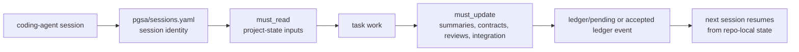
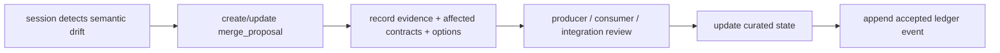

# PGSA Harness Core

[中文说�](README.zh-CN.md)

PGSA Harness Core is an agent-first, repo-local project-coherence protocol.
Version 1.2 keeps the core protocol file-based and embeddable, while adding a
review-first package-management layer for external skills/harnesses and an
optional Codex SDK runner for repeatable multi-session orchestration.

It is not a Python framework and it does not live inside any model. It lives in
a repository as files that coding agents can read, update, diff, review, and
carry across sessions.

## What It Is

Coding agents can complete local tasks while the project still drifts. A
backend session can change an API while a frontend session keeps the old
assumption. Docs can describe stale behavior. Local checks can pass while the
project no longer fits together.

PGSA makes that shared project state explicit:

```text
agent reads repo-local PGSA artifacts
-> agent performs the task
-> agent updates contracts, summaries, reviews, integration state, or ledger drafts
-> next agent continues from inspectable project state
```

The communication medium is the repository, not private chat history.

Use PGSA when work is long-running, split across agent sessions, or likely to
change shared assumptions. For small one-off edits, it may be unnecessary.

## File Model

The protocol source lives under `protocol/`:

- `protocol/SKILL.md`: the agent workflow.
- `protocol/artifact-map.md`: what each PGSA artifact means.
- `protocol/templates/`: starter artifacts copied into a target repo's `pgsa/` layer.
- `protocol/schemas/`: JSON schemas for structured artifacts.
- `protocol/rules/`: short boundaries agents should follow.
- `protocol/roles/`: optional role examples and role schemas.
- `protocol/capabilities/`: optional advanced capability packs.
- `protocol/adapters/`: optional adapter specifications for runtime/security/interpretability tools.

A target project using PGSA has a `pgsa/` folder:

```text
pgsa/
  project.yaml
  sessions.yaml
  harness/
  contracts/
  state/
  merge_proposals/
  reviews/
  integration/
  ledger/
  imports/
    inbox/
    sources/
  reports/

  # optional advanced mode
  gates/
  runtime/
  skills/
  evidence/
  factory/
  scenarios/
  audits/
```

Core artifact roles:

| Artifact | Role |
| --- | --- |
| `project.yaml` | Project identity, goals, modules, and acceptance criteria. |
| `sessions.yaml` | Session identity, ownership, required reads, required updates, and handoff targets. |
| `harness/<session>.md` | Per-session operating instructions. |
| `contracts/*.json` | Shared producer/consumer assumptions, review state, acceptance tests, and breaking-change state. |
| `state/*.summary.md` | Compressed session memory plus recovery snapshot: scope, failed commands, touched files, open risks, and next action. |
| `merge_proposals/*.md` | Open semantic conflict records with evidence, options, and decision owner. |
| `reviews/*` | Review-gate status and blocking issues. |
| `integration/integration_report.json` | Current integration readiness, blockers, open merge proposals, and contract review state. |
| `ledger/coherence_ledger.jsonl` | Append-only accepted project-coherence events. |
| `ledger/pending/*.json` | Per-session event drafts for parallel runs, promoted by review/integration. |
| `imports/index.json` | External harness/skill/protocol import index, reviewed before activation. |
| `imports/inbox/` | Drop folder for external repos or skill packs before import processing. |
| `imports/sources/<source_id>/` | Optional copied external source material for repo-local review. |

## Built-In Packs Vs Project Import Packages

Keep bundled PGSA material separate from user-added external material:

| Location | Owner | Purpose |
| --- | --- | --- |
| `protocol/capabilities/`, `protocol/adapters/`, `protocol/templates/`, `protocol/schemas/` | PGSA harness | Shipped reference artifact shapes and optional advanced packs. |
| target project `pgsa/imports/inbox/` | user / importing agent | Temporary drop folder for external repos, skills, prompt packs, or docs. |
| target project `pgsa/imports/sources/<source_id>/` | project | Reviewable local copy of imported external material. |
| target project `pgsa/imports/index.json` | project | Import registry: source metadata, selected files, detected skills, review state, and triage session. |
| target project `pgsa/skills/` | project, advanced mode | Accepted skill provenance or signed skill manifests, not raw unreviewed imports. |

Raw external skills should not be mixed into the shipped `protocol/` folders.
They should
first enter `pgsa/imports/`, be reviewed by `external_import_review`
or a custom import-review session, and only then be promoted into project-owned
state such as `pgsa/skills/`, roles, contracts, capabilities, merge proposals,
or ledger events.

This is PGSA's package-management boundary. External skills, prompt packs,
harnesses, and reference protocols are treated as import packages: indexed,
copied, reviewed, and recorded before they can affect project state. The default
`external_import_review` session is the package-review session responsible for
triage. It is registered like any other PGSA session, with explicit
`must_read`, `must_update`, handoff, and ledger obligations.

## Core Workflow

Every agent session follows the same loop:

1. Read `pgsa/project.yaml`.
2. Read `pgsa/sessions.yaml`.
3. Identify the active session and inspect its `role`, `owner_scope`,
   `produces`, `consumes`, `must_read`, `must_update`, and `handoff_to`.
4. Read `pgsa/harness/<session>.md`.
5. Read relevant contracts, summaries, reviews, integration reports, merge
   proposals, and ledger events.
6. Do the task.
7. Update the affected PGSA artifacts before handoff.
8. If shared assumptions changed, update a contract or create a merge proposal.
9. If a decision was accepted, append a ledger event or submit a pending event
   for review.



## Next-Session Recovery

Repo-local state only helps if the next run can recover without replaying chat.
For that reason, each `pgsa/state/<session>.summary.md` should keep a short
recovery snapshot:

- current scope;
- last known good state;
- failed commands or checks that still matter;
- touched files, including files inspected or partially edited;
- open risks, blockers, or unresolved assumptions;
- next recommended action.

This snapshot is intentionally smaller than a transcript. It gives the next
Codex, Claude Code, or human reviewer enough context to restart work, decide
what must be re-run, and avoid repeating failed commands.

## Multi-Session Registration

PGSA is registration-based. Each project session is declared in
`pgsa/sessions.yaml` with a role, ownership scope, produced artifacts, consumed
artifacts, required reads, required updates, handoff targets, and escalation
policy.

Example session identities:

```text
backend
  owns API contracts and backend summary

frontend_components
  consumes API contracts and owns UI review state

docs_security_integration
  reads contracts, summaries, reviews, merge proposals, integration state,
  and ledger before deciding readiness

external_import_review
  triages imported harnesses, skill packs, protocols, and docs before promotion
```

The registration tells Codex, Claude Code, or another coding-agent session what
it owns, what it must inspect, and what it must update before handoff.

PGSA includes a default active `external_import_review` session for import
triage. Agents can also register a new identity when the user asks for a custom
role:

```bash
PYTHONPATH=pgsa-harness/tools/python python3 -m pgsa_cli.main --root . session register research_import \
  --role external-skill-review \
  --scope "triage imported skills and protocols" \
  --must-read imports/index.json,imports/sources/external_pack/ \
  --must-update state/research_import.summary.md,ledger/pending/ \
  --handoff-to docs_security_integration \
  --self-registered
```

This creates the `sessions.yaml` entry plus matching `harness/` and `state/`
files. The new session still has explicit scope and required artifacts; it does
not receive global authority over the repo.

## External Skill And Harness Package Management

External harnesses, skills, prompt packs, protocol folders, or docs should be
managed as reviewable packages before a session uses them.

For direct import:

```bash
PYTHONPATH=pgsa-harness/tools/python python3 -m pgsa_cli.main --root . import add external_pack \
  --path ../external-pack \
  --kind skill_pack \
  --session external_import_review
```

For the inbox workflow, copy or clone external sources into
`pgsa/imports/inbox/`, then process the inbox:

```bash
cp -R ../external-pack pgsa/imports/inbox/external_pack
PYTHONPATH=pgsa-harness/tools/python python3 -m pgsa_cli.main --root . import process-inbox
PYTHONPATH=pgsa-harness/tools/python python3 -m pgsa_cli.main --root . import review external_pack
PYTHONPATH=pgsa-harness/tools/python python3 -m pgsa_cli.main --root . import stats
```

`process-inbox` indexes each inbox item, copies it into
`pgsa/imports/sources/<source_id>/`, records it in `pgsa/imports/index.json`,
and clears the processed inbox item by default. Pass `--keep` only when you are
debugging.

`import review <source_id>` is the review step. It scans the copied source for
`SKILL.md`, README, and schema files, updates the import record to `reviewed`,
and writes the result into `harness/<session>.md`,
`state/<session>.summary.md`, and `ledger/pending/`. It still does not install
or trust the imported content automatically.

The import command records source kind, origin path, optional local copy,
selected files, file count, total bytes, detected skill entries, review
artifacts, and the recommended triage session in `pgsa/imports/index.json`.

The intended flow is review-first package management:

1. Place or copy the external source into `pgsa/imports/inbox/`.
2. Let `external_import_review` or another import-review session process it.
3. Let that session read `imports/index.json` and `imports/sources/<source_id>/`.
4. Run `pgsa import review <source_id>` or have the session write the same
   review artifacts manually.
5. Promote only accepted material into contracts, summaries, roles, capability
   manifests, `pgsa/skills/`, merge proposals, or ledger events.

Imported content is source material, not trusted project guidance. This keeps
external skills from silently changing the project contract or overriding
current PGSA state.

To run a real external import verification against public skill sources:

```bash
python3 tools/scripts/verify_external_skill_imports.py
```

The script clones external skills into a temporary project, drops them into
`pgsa/imports/inbox/`, runs `process-inbox`, runs `import review`, verifies that
the inbox was cleaned, checks review artifacts and pending ledger events, and
runs `pgsa validate`.

## Conflict Lifecycle And Ledger Boundary

PGSA does not silently auto-merge conflicting writes, and it is not a PR merge
agent. Git, PRs, CI, and code review remain the right tools for code diffs,
textual conflicts, implementation review, and final merge.

PGSA works one layer earlier: it records cross-session project semantics that
may not appear as a Git conflict.

Conflict lifecycle:



Boundary:

| Layer | Files | Meaning |
| --- | --- | --- |
| Current curated state | `sessions.yaml`, `contracts/`, `state/`, `merge_proposals/`, `reviews/`, `integration/` | Editable project state: roles, assumptions, open conflicts, review state, and integration readiness. |
| Pending history | `ledger/pending/*.json` | Draft event records from parallel sessions, not yet accepted. |
| Accepted history | `ledger/coherence_ledger.jsonl` | Append-only timeline of accepted project-coherence events and decisions. |

When a session detects semantic drift, such as a contract changing while a
consumer still holds the old assumption, it writes or updates
`pgsa/merge_proposals/*.md` with evidence, affected contracts, resolution
options, and a decision owner.

Only after review or integration accepts the resolution should the project append
an event to `pgsa/ledger/coherence_ledger.jsonl`. The ledger should reference
the curated artifacts; it should not become a dumping ground for raw context,
unaccepted conclusions, or full chat transcripts.

For parallel runs, sessions should write `pgsa/ledger/pending/*.json` first. The
review/integration session promotes accepted events into the coherence ledger.

## Why This Is Not PR Automation

PGSA is not a PR merge agent and does not auto-resolve Git conflicts or merge
code. PRs are still the right place to review a code diff, run CI, discuss
implementation, and merge changes.

PGSA records the project-state that coding-agent sessions need before a PR is
ready:

- which session owns which part of the project;
- which contracts and summaries must be read before editing;
- which artifacts must be updated before handoff;
- which semantic assumptions changed even when Git has no text conflict;
- why integration is ready or blocked.

The main advantage over plain PR review is semantic continuity. A backend
session can change an API in a way that still compiles, while a frontend session
keeps the old assumption. Git may not conflict and a PR may not expose the drift
until late review. PGSA records that drift as repo-local project state so the
next agent does not depend on private chat history.

## Quick Start

Copy `pgsa-harness/` into any target project as a normal folder:

```text
target-project/
  pgsa-harness/
  pgsa/
  src/
  tests/
```

The agent-facing protocol is `pgsa-harness/protocol/SKILL.md`. The target
project's durable coordination state is `pgsa/`.

Optional initialization and validation can run from the embedded folder without
global installation:

```bash
PYTHONPATH=pgsa-harness/tools/python python3 -m pgsa_cli.main --root . init --force
PYTHONPATH=pgsa-harness/tools/python python3 -m pgsa_cli.main --root . validate
PYTHONPATH=pgsa-harness/tools/python python3 -m pgsa_cli.main --root . export-context --session backend
```

Advanced artifacts are optional:

```bash
PYTHONPATH=pgsa-harness/tools/python python3 -m pgsa_cli.main --root . init --advanced --force
PYTHONPATH=pgsa-harness/tools/python python3 -m pgsa_cli.main --root . validate --strict-advanced
```

Python is intentionally outside the main path. The protocol is the files.

## Codex And Claude Code Use

For Codex, put PGSA guidance in the target repository's `AGENTS.md`. For Claude
Code, put the equivalent guidance in `CLAUDE.md`; this repository includes both
files as examples.

Minimal Codex prompt:

```text
Use PGSA session backend. Read AGENTS.md, pgsa-harness/protocol/SKILL.md,
pgsa/sessions.yaml, and the backend must_read artifacts before editing. Work
inside the backend owner_scope unless a merge proposal is needed. Update backend
must_update artifacts before handoff.
```

Minimal Claude Code prompt:

```text
Use PGSA session frontend_components. Read CLAUDE.md,
pgsa-harness/protocol/SKILL.md, pgsa/sessions.yaml, and the frontend_components
must_read artifacts before editing. If UI assumptions no longer match a
contract, create or update a merge proposal instead of relying on conversation
memory.
```

Multiple sessions can run from separate terminals, separate worktrees, or
separate agent threads. Give each one a distinct PGSA �¥‘•¹Ñ¥Ñäè()���‰…Í )�½‘•à€‰UÍ”�AM�Í•ÍÍ¥½¸�‰…�­•¹�¸�I•…��9QL¹µ�°�Á�Í„µ¡…ɹ•Í̽Áɽѽ�½°½M-%10¹µ�°�Á�Í„½Í•ÍÍ¥½¹Ì¹å…µ°°�…¹��Ñ¡”�‰…�­•¹��µÕÍÑ}É•…��…ÉÑ¥™…�Ñ̸�UÁ‘…Ñ”�‰…�­•¹��µÕÍÑ}ÕÁ‘…Ñ”�…ÉÑ¥™…�ÑÌ�‰•™½É”�¡…¹‘½™˜¸ˆ()�½‘•à€‰UÍ”�AM�Í•ÍÍ¥½¸�™É½¹Ñ•¹‘}�½µÁ½¹•¹Ñ̸�I•…��9QL¹µ�°�Á�Í„µ¡…ɹ•Í̽Áɽѽ�½°½M-%10¹µ�°�Á�Í„½Í•ÍÍ¥½¹Ì¹å…µ°°�™É½¹Ñ•¹‘}�½µÁ½¹•¹ÑÌ�µÕÍÑ}É•…��…ÉÑ¥™…�ÑÌ°�…¹��‰…�­•¹���½¹ÑÉ…�Ğ�ÍÑ…Ñ”¸�UÁ‘…Ñ”�™É½¹Ñ•¹��µÕÍÑ}ÕÁ‘…Ñ”�…ÉÑ¥™…�ÑÌ�‰•™½É”�¡…¹‘½™˜¸ˆ()�½‘•à€‰UÍ”�AM�Í•ÍÍ¥½¸�‘½�Í}Í•�ÕÉ¥Ñå}¥¹Ñ•�É…Ñ¥½¸¸�I•…��9QL¹µ�°�Á�Í„µ¡…ɹ•Í̽Áɽѽ�½°½M-%10¹µ�°�…±°�ÍÕµµ…É¥•Ì°�É•Ù¥•İÌ°��½¹ÑÉ…�ÑÌ°�µ•É�”�ÁɽÁ½Í…±Ì°�¥¹Ñ•�É…Ñ¥½¸�ÍÑ…Ñ”°�…¹��±•‘�•È¸�•�¥‘”�É•…‘¥¹•ÍÌ�…¹��‰±½�¬�¥¹Ñ•�É…Ñ¥½¸�¥˜�չɕͽ±Ù•��Í•µ…¹Ñ¥Œ�‘É¥™Ğ�É•µ…¥¹Ì¸ˆ)��€()
±…Õ‘”�
½‘”��…¸�‰”�±…Õ¹�¡•��Ñ¡”�Í…µ”�İ…ä�ݥѠ���±…Õ‘”€‰UÍ”�AM�Í•ÍÍ¥½¸€¸¸¸‰€¸()½È�
½‘•à�ÍÕ‰…�•¹Ğ�ݽɭ™±½İÌ°�­••À�Ñ¡”�Á…É•¹Ğ�Í•ÍÍ¥½¸�…Ì�Ñ¡”�¥¹Ñ•�ɅѽÈ�…¹��…ͬ)ÍÕ‰…�•¹ÑÌ�Ѽ�É•ÑÕɸ�AMµÉ•…‘ä�ÍÕµµ…É¥•Ì�¥¹ÍÑ•…��½˜�İɥѥ¹œ�•Ù•Éä�…ÉÑ¥™…�Ğ)‘¥É•�ѱä¸((ŒŒ�=ÁÑ¥½¹…°�
½‘•à�M,�•µ¼()Q¡”�½ÁÑ¥½¹…°��Í‘¬½€�™½±‘•È�¥Ì�™½È�ÕÍ•ÉÌ�İ¡¼�…±É•…‘ä�İ…¹Ğ�Ѽ�ÉÕ¸�AM�Í•ÍÍ¥½¹Ì)ѡɽÕ� �Ñ¡”�
½‘•à�M,¸�%Ğ�¥Ì�„�Õ͕ɱ…¹��‘•µ¼°�¹½Ğ�Ñ¡”��½É”�AM�Á…Ñ �…¹��¹½Ğ�…¸)=Á•¹$�•¹‘½ÉÍ•µ•¹Ğ�½È�¥¹Ñ•�É…Ñ¥½¸��±…¥´¸�Q¡”�M,�É•™•É•¹�”�¥Ì(ñ¡ÑÑÁÌè¼½‘•Ù•±½Á•É̹½Á•¹…¤¹�½´½�½‘•à½Í‘¬�ÁåÑ¡½¸µ±¥‰É…Éäø¸()AM�ÍÕÁÁ½ÉÑÌ�Ñݼ�
½‘•à�ÕÍ…�”�µ½‘•Ìè()ğ�5½‘”�ğ�!½Ü�¥Ğ�ݽɭÌ�ğ�	•ÍĞ�™½È�ğ�QÉ…‘•½™˜�ğ)ğ€´´´�ğ€´´´�ğ€´´´�ğ€´´´�ğ)ğ�]¥Ñ¡½ÕĞ�M,�ğ�MÑ…ÉĞ�
½‘•à�µ…¹Õ…±±ä�…¹���¥Ù”�¥Ğ�„�AM�Í•ÍÍ¥½¸�ÁɽµÁĞ°�™½È�•á…µÁ±”��UÍ”�AM�Í•ÍÍ¥½¸�‰…�­•¹�¸¸¹€¸�
½‘•à�É•…‘Ì��9QL¹µ‘€°��Áɽѽ�½°½M-%10¹µ‘€°�…¹���Á�Í„½€�…ÉÑ¥™…�ÑÌ�‘¥É•�ѱä¸�ğ�9½Éµ…°�¥¹Ñ•É…�Ñ¥Ù”�ݽɬ°�½¹”µ½™˜�Í•ÍÍ¥½¹Ì°�µ…¹Õ…°��½¹Ñɽ°°�…¹��µ…᥵մ�ÑÉ…¹ÍÁ…É•¹�ä¸�ğ�Q¡”�ÕÍ•È�ÍÑ…ÉÑÌ�…¹���½½É‘¥¹…Ñ•Ì�•…� �Í•ÍÍ¥½¸�µ…¹Õ…±±ä¸�ğ)ğ�]¥Ñ �M,�ğ��Í‘¬½�½‘•á}Á�Í…}ÉÕ¹¹•È¹Áå€�É•…‘Ì��Á�Í„½Í•ÍÍ¥½¹Ì¹å…µ±€°�‰Õ¥±‘Ì�½¹”�AMµ…İ…É”�ÁɽµÁĞ�Á•È�Í•ÍÍ¥½¸°�ÍÑ…ÉÑÌ�
½‘•à�M,�Ñ¡É•…‘Ì�¥¸�Ñ¡”�Ñ…É�•Ğ�€´µÉ½½Ñ€°�…¹��…Í­Ì�•…� �Ñ¡É•…��Ѽ�ÕÁ‘…Ñ”��µÕÍÑ}ÕÁ‘…Ñ•€�…ÉÑ¥™…�Ñ̸�ğ�Aɽ�É…µµ…Ñ¥Œ�½É�¡•ÍÑÉ…Ñ¥½¸°�É•Á•…Ñ•��±½¹œµÉÕ¹¹¥¹œ��¡•�­Ì°�
$½¥¹Ñ•É¹…°�ѽ½±Ì°�…¹��±…Õ¹�¡¥¹œ�µÕ±Ñ¥Á±”�É•�¥ÍÑ•É•��Í•ÍÍ¥½¹Ì��½¹Í¥ÍÑ•¹Ñ±ä¸�ğ�I•ÅեɕÌ�Ñ¡”�½ÁÑ¥½¹…°�
½‘•à�M,�…¹��É•µ…¥¹Ì�Õ͕ɱ…¹��½É�¡•ÍÑÉ…Ñ¥½¸ì�AM�ÍÑ¥±°�‘½•Ì�¹½Ğ�‰åÁ…ÍÌ�
½‘•à�Í…¹‘‰½á¥¹œ�½È�…ÁÁɽم±Ì¸�ğ()Q¡”�M,�…‘Ù…¹Ñ…�”�¥Ì�É•Á•…Ñ…‰¥±¥Ñä¸�%Ğ�ÑÕɹÌ�Ñ¡”�Í…µ”�É•Á¼µ±½�…°�AM�Í•ÍÍ¥½¸)É•�¥ÍÑÉä�¥¹Ñ¼��½¹Í¥ÍÑ•¹Ğ�
½‘•à�Ñ¡É•…��ÍÑ…ÉÑÌ°�İ¡¥±”�Ñ¡”�¹½¸µM,�Á…Ñ �É•µ…¥¹Ì�Ñ¡”)Á±…¥¸�™¥±”½Áɽѽ�½°�ݽɭ™±½Ü�™½È�•Ù•Éå‘…ä�¥¹Ñ•É…�Ñ¥Ù”�ÕÍ”¸()���‰…Í )ÁåÑ¡½¸Ì�Í‘¬½�½‘•á}Á�Í…}ÉÕ¹¹•È¹Á䀴µÉ½½Ğ€¸€´µ�½¹™¥œ�Í‘¬½�½‘•àµÉÕ¹¹•È¹�½¹™¥œ¹•á…µÁ±”¹©Í½¸€´µ‘ÉäµÉÕ¸)��€()½È�„�É•…°�M,�ÉÕ¸°�¥¹ÍÑ…±°�Ñ¡”�½™™¥�¥…°�M,�Í•Á…É…Ñ•±äè()���‰…Í )Á¥À�¥¹ÍÑ…±°�½Á•¹…¤µ�½‘•à)ÁåÑ¡½¸Ì�Í‘¬½�½‘•á}Á�Í…}ÉÕ¹¹•È¹Á䀴µÍÑ…Éе½¹±ä)ÁåÑ¡½¸Ì�Í‘¬½�½‘•á}Á�Í…}ÉÕ¹¹•È¹Á䀴µÉ½½Ğ€¸€´µ�½¹™¥œ�Í‘¬½�½‘•àµÉÕ¹¹•È¹�½¹™¥œ¹•á…µÁ±”¹©Í½¸)��€()Q¡”�ÉÕ¹¹•È�É•…‘Ì��Á�Í„½Í•ÍÍ¥½¹Ì¹å…µ±€°�‰Õ¥±‘Ì�½¹”�AMµ…İ…É”�ÁɽµÁĞ�Á•È)É•�¥ÍÑ•É•��Í•ÍÍ¥½¸°�ÍÑ…ÉÑÌ�•…� �
½‘•à�M,�Ñ¡É•…��¥¸�Ñ¡”�Ñ…É�•Ğ�Áɽ©•�Ğ�ɽ½Ğ)Á…ÍÍ•��‰ä�€´µÉ½½Ñ€°�…¹��…Í­Ì�•…� �Ñ¡É•…��Ѽ�ÕÁ‘…Ñ”�¥ÑÌ��µÕÍÑ}ÕÁ‘…Ñ•€�…ÉÑ¥™…�ÑÌ)‰•™½É”�¡…¹‘½™˜¸�%Ğ�ÍÑ…åÌ�Õ͕ɱ…¹��½É�¡•ÍÑÉ…Ñ¥½¸è�AM�É•µ…¥¹Ì�Ñ¡”�™¥±”�Áɽѽ�½°°)…¹��
½‘•à�Í…¹‘‰½á¥¹œ½…ÁÁɽم±Ì�É•µ…¥¸�
½‘•à�Ì�É•ÍÁ½¹Í¥‰¥±¥Ñä¸�½È�Ñ•µÁ½É…Éä)Ù•É¥™¥�…Ñ¥½¸�Éչ̰�Í•Ğ�€‰•Á¡•µ•É…°ˆè�ÑÉÕ•€�¥¸�Ñ¡”�M,��½¹™¥œì�±•…Ù”�¥Ğ��™…±Í•€)İ¡•¸�M,µÉÕ¸�Í•ÍÍ¥½¹Ì�Í¡½Õ±��¥É•µ…¥¸�É•ÍÕµ…‰±”¸((ŒŒ�=ÁÑ¥½¹…°�AåÑ¡½¸�Q½½±Ì()Q¡”�½ÁÑ¥½¹…°�
1$��…¸�¥¹¥Ñ¥…±¥é”�…¹��Ù…±¥‘…Ñ”�AM�…ÉÑ¥™…�ÑÌ�™½È�ÕÍ•ÉÌè()���‰…Í )ÁåÑ¡½¸Ì€µ´�Á¥À�¥¹ÍÑ…±°€€µ”�ѽ½±Ì½ÁåÑ¡½¸)Á�Í„€´µÉ½½Ğ�•á…µÁ±•Ì½Ñ•…µÑ…ͬµÁɽ©•�щ½…É��Ù…±¥‘…Ñ”)Á�Í„€´µÉ½½Ğ�•á…µÁ±•Ì½Ñ•…µÑ…ͬµÁɽ©•�щ½…É��‘É¥™ĞµÉ•Á½ÉĞ)Á�Í„€´µÉ½½Ğ€½ÑµÀ½Á�Í„µ‘•µ¼�¥¹¥Ğ€´µ™½É�”)��€()]¥Ñ¡½ÕĞ�¥¹ÍÑ…±±¥¹œè()���‰…Í )AeQ!=9AQ õѽ½±Ì½ÁåÑ¡½¸�ÁåÑ¡½¸Ì€µ´�Á�Í…}�±¤¹µ…¥¸€´µÉ½½Ğ�•á…µÁ±•Ì½Ñ•…µÑ…ͬµÁɽ©•�щ½…É��ÍÑ…ÑÕÌ)��€()½È��½¹Ù•¹¥•¹�”°�€´µÉ½½Ñ€�¥Ì�…��•ÁÑ•��‰•™½É”�½È�…™Ñ•È�Ñ¡”�ÍÕ‰�½µµ…¹�è()���‰…Í )Á�Í„€´µÉ½½Ğ�•á…µÁ±•Ì½Ñ•…µÑ…ͬµÁɽ©•�щ½…É��Ù…±¥‘…Ñ”)Á�Í„�Ù…±¥‘…Ñ”€´µÉ½½Ğ�•á…µÁ±•Ì½Ñ•…µÑ…ͬµÁɽ©•�щ½…É�)��€()Q¡”�
1$�¥Ì�¡•±Á•È�…Õѽµ…Ñ¥½¸¸�%Ğ�‘½•Ì�¹½Ğ�‘•�¥‘”�Í•µ…¹Ñ¥Œ�ÑÉÕÑ °�ɕͽ±Ù”�µ•É�”)�½¹™±¥�ÑÌ°�½È�É•Á±…�”�…�•¹Ğ�©Õ‘�µ•¹Ğ¸((ŒŒ�]¡…Ğ�ØĸÈ�‘‘Ì()Y•ÉÍ¥½¸€Ä¸È�‰Õ¥±‘Ì�½¸�Ñ¡”�ØĸÄ�Áɽѽ�½°½…‘Ù…¹�•�µÁ…�¬�‰…Í•±¥¹”�‰ä�™½Éµ…±¥é¥¹œ)Ñݼ�ÁÉ…�Ñ¥�…°�ÕÍ…�”�±…å•ÉÌè�½ÁÑ¥½¹…°�
½‘•à�M,�½É�¡•ÍÑÉ…Ñ¥½¸�…¹��É•Ù¥•Üµ™¥ÉÍĞ)•áѕɹ…°�Í­¥±°½¡…ɹ•ÍÌ�Á…�­…�”�µ…¹…�•µ•¹Ğ¸()
½µÁ…É•��ݥѠ�Ñ¡”�ØĸÄ�‰…Í•±¥¹”è()ğ€Ä¸Ä�‰…Í•±¥¹”�ğ€Ä¸È�¥µÁɽٕµ•¹Ğ�ğ)ğ€´´´�ğ€´´´�ğ)ğ�
½É”�Áɽѽ�½°�Á±ÕÌ�½ÁÑ¥½¹…°�…‘Ù…¹�•��Á…�­Ì¸�ğ�áѕɹ…°�Í­¥±°½¡…ɹ•ÍÌ�Á…�­…�”�µ…¹…�•µ•¹Ğ�ѡɽÕ� ��¥µÁ½ÉÑ̽¥¹‰½à½€°��¥µÁ½ÉÑ̽ͽÕÉ�•Ì½€°��¥µÁ½ÉÑ̽¥¹‘•à¹©Í½¹€°�…¹��Ñ¡”�‘•‘¥�…Ñ•���•áѕɹ…±}¥µÁ½ÉÑ}É•Ù¥•İ€�Í•ÍÍ¥½¸¸�ğ)ğ��•¹ÑÌ��½Õ±��É•…��AM�™¥±•Ì�µ…¹Õ…±±ä¸�ğ�
½¹�É•Ñ”�¹½¸µM,�ÁɽµÁÑÌ�Á±ÕÌ�…¸�½ÁÑ¥½¹…°�
½‘•à�M,�ÉÕ¹¹•È�Ñ¡…Ğ�ÍÑ…ÉÑÌ�É•�¥ÍÑ•É•��AM�Í•ÍÍ¥½¹Ì�É•Á•…Ñ…‰±ä�™É½´��Á�Í„½Í•ÍÍ¥½¹Ì¹å…µ±€¸�ğ)ğ�%µÁ½ÉÑ•��µ…Ñ•É¥…°��½Õ±��‰”�É•™•É•¹�•��‰ä��½¹Ù•¹Ñ¥½¸¸�ğ�%µÁ½ÉÑ•��Á…�­…�•Ì�…É”��½Á¥•�°�¥¹‘•á•�°�É•Ù¥•İ•�°�ÍÕµµ…É¥é•�°�…¹��É•�½É‘•��¥¸�Á•¹‘¥¹œ�±•‘�•È�•Ù•¹ÑÌ�‰•™½É”�Áɽµ½Ñ¥½¸¸�ğ)ğ�M­¥±°�Áɽٕ¹…¹�”�•á¥ÍÑ•��…Ì�…¸�…‘Ù…¹�•��…ÉÑ¥™…�Ğ�Í¡…Á”¸�ğ���•ÁÑ•��¥µÁ½ÉĞ�µ•Ñ…‘…Ñ„��…¸�‰”�Áɽµ½Ñ•��¥¹Ñ¼��Á�Í„½Í­¥±±Ì½€ì�É…Ü�չɕ٥•İ•��•áѕɹ…°��½¹Ñ•¹Ğ�ÍÑ…åÌ�½ÕĞ�½˜�Í¡¥ÁÁ•���Áɽѽ�½°½€¸�ğ)ğ�I•�½Ù•Éä�…¹���½¹™±¥�Ğ�…ÉÑ¥™…�ÑÌ�•á¥ÍÑ•�¸�ğ�I5�¹½Ü�‘½�Õµ•¹ÑÌ�Ñ¡”�‘…¥±äµÕÍ”�Á…Ñ è�É•�½Ù•Éä�͹…ÁÍ¡½ÑÌ°��µÕÍÑ}É•…‘€½�µÕÍÑ}ÕÁ‘…Ñ•€°�Í•µ…¹Ñ¥Œ��½¹™±¥�ÑÌ°�±•‘�•È�‰½Õ¹‘…É¥•Ì°�M,�ÙÌ�¹½¸µM,�ÕÍ”°�…¹��¥µÁ½ÉеÁ…�­…�”�É•Ù¥•Ü¸�ğ()Q¡”�ØĸÈ�Á…�­…�”µµ…¹…�•µ•¹Ğ�Á…Ñ �¥Ì�¥¹Ñ•¹Ñ¥½¹…±±ä�¹…ÉɽÜè()���Ñ•áĞ)•áѕɹ…°�ͽÕÉ�”(´ø�Á�Í„½¥µÁ½ÉÑ̽¥¹‰½à¼(´ø�Á�Í„�¥µÁ½ÉĞ�Áɽ�•Í̵¥¹‰½à(´ø�Á�Í„½¥µÁ½ÉÑ̽ͽÕÉ�•Ì¼ñͽÕÉ�•}¥�ø¼€¬�¥µÁ½ÉÑ̽¥¹‘•à¹©Í½¸(´ø�•áѕɹ…±}¥µÁ½ÉÑ}É•Ù¥•Ü�Í•ÍÍ¥½¸(´ø�É•Ù¥•Ü�…ÉÑ¥™…�ÑÌ€¬�±•‘�•È½Á•¹‘¥¹œ¼(´ø�…��•ÁÑ•��Áɽµ½Ñ¥½¸�¥¹Ñ¼�Á�Í„½Í­¥±±Ì°��½¹ÑÉ…�ÑÌ°�ɽ±•Ì°��…Á…‰¥±¥Ñ¥•Ì°�½È�±•‘�•È)��€()Q¡”�Õ¹‘•É±å¥¹œ�ØĸÄ�…‘Ù…¹�•��…É•…Ì�É•µ…¥¸è()ğ�É•„�ğ�¥±•Ì�ğ�]¡…Ğ�¥Ğ�…‘‘Ì�ğ)ğ€´´´�ğ€´´´�ğ€´´´�ğ)ğ�M•ÍÍ¥½¸�É•�¥ÍÑÉä�ğ��Á�Í„½Í•ÍÍ¥½¹Ì¹å…µ±€�ğ�
±•…È�Í•ÍÍ¥½¸�¥‘•¹Ñ¥Ñä°�½İ¹•ÉÍ¡¥À°��µÕÍÑ}É•…‘€°��µÕÍÑ}ÕÁ‘…Ñ•€°�¡…¹‘½™˜°�…¹��•Í�…±…Ñ¥½¸�ÉÕ±•Ì¸�ğ)ğ�M•µ…¹Ñ¥Œ��½¹™±¥�ÑÌ�ğ��Á�Í„½µ•É�•}ÁɽÁ½Í…±Ì½€�ğ�I•Ù¥•İ…‰±”�É•�½É‘Ì�™½È�…ÍÍÕµÁÑ¥½¸�‘É¥™Ğ�Ñ¡…Ğ�µ…ä�¹½Ğ�…ÁÁ•…È�…Ì�„�¥Ğ��½¹™±¥�и�ğ)ğ�Y•É¥™¥�…Ñ¥½¸�Á±…¹¹¥¹œ�ğ��Á�Í„½�…ѕ̽€°��Á�Í„½Í�•¹…É¥½Ì½€�ğ�Y•É¥™¥�…Ñ¥½¸�‰±Õ•ÁÉ¥¹ÑÌ�…¹��Í�•¹…É¥¼�Ñ•ÍÑÌ�Ñ¡…Ğ�‘•Í�É¥‰”�İ¡…Ğ�•Ù¥‘•¹�”�Í¡½Õ±��•á¥ÍĞ�‰•™½É”�¥¹Ñ•�É…Ñ¥½¸¸�ğ)ğ�I•Ù¥•Ü�ɽÕÑ¥¹œ�ğ��Á�Í„½É•Ù¥•İ̽€�ğ�I¥Í¬µ…İ…É”�É•Ù¥•ÜµÉ½ÕÑ¥¹œ�…ÉÑ¥™…�ÑÌ�™½È�‘•�¥‘¥¹œ�İ¡¼�½È�İ¡…Ğ�Í¡½Õ±��¥¹ÍÁ•�Ğ�„��¡…¹�”¸�ğ)ğ�Iչѥµ”�•Ù¥‘•¹�”�ğ��Á�Í„½Éչѥµ”½€°��Á�Í„½•Ù¥‘•¹�”½€�ğ�I•�½É‘Ì�™É½´�•áѕɹ…°�Éչѥµ”½Í•�ÕÉ¥Ñä�ѽ½±Ì�ݥѡ½ÕĞ��±…¥µ¥¹œ�AM�•¹™½É�•Ì�Éչѥµ”�Á½±¥�ä�¥ÑÍ•±˜¸�ğ)ğ�
…Á…‰¥±¥Ñä��½¹ÑÉ…�ÑÌ�ğ��Á�Í„½Éչѥµ”½€�ğ�áÁ±¥�¥Ğ��…Á…‰¥±¥Ñä�…¹��…ÁÁɽم°�•áÁ•�Ñ…Ñ¥½¹Ì�™½È�Í•ÍÍ¥½¹Ì�½È�ѽ½±Ì¸�ğ)ğ�M¥�¹•��Í­¥±±Ì�ğ��Á�Í„½Í­¥±±Ì½€�ğ�=ÁÑ¥½¹…°�Í­¥±°�Áɽٕ¹…¹�”�É•�½É‘Ì°�‘¥�•ÍÑÌ°�…¹��ÑÉÕÍĞ�µ•Ñ…‘…Ñ„¸�ğ)ğ�…�ѽÉäµÍÑå±”�Á±…¹¹¥¹œ�ğ��Á�Í„½™…�ѽÉä½€�ğ�Q…ͬ�Ì�…¹��‘•�½µÁ½Í¥Ñ¥½¸�Á±…¹Ìì�¹½Ğ�…¸�…Õѽ¹½µ½ÕÌ�™…�ѽÉä�½È�¡½ÍÑ•��½É�¡•ÍÑɅѽȸ�ğ)ğ�
½�¹¥Ñ¥Ù”�…Õ‘¥Ğ�¹½Ñ•Ì�ğ��Á�Í„½…Õ‘¥Ñ̽€�ğ�!åÁ½Ñ¡•Í¥Ìµ½¹±ä�É•Í•…É� �¹½Ñ•Ìì�¹½Ğ�µ½‘•°�¥¹Ñ•ÉÁÉ•Ñ…‰¥±¥Ñä�•Ù¥‘•¹�”�‰ä�¥ÑÍ•±˜¸�ğ()±°�…‘Ù…¹�•��Á…�­Ì�…É”�½ÁÑ¥½¹…°¸�Q¡•ä�…É”�É•Á¼µ±½�…°�…ÉÑ¥™…�Ğ�Í¡…Á•Ì°�¹½Ğ)Í•ÉÙ¥�•Ì°�‘…•µ½¹Ì°�
$°�Í…¹‘‰½á¥¹œ°�µ•É�”�…Õѽµ…Ñ¥½¸°�½È�Í•�ÕÉ¥Ñä�•¹™½É�•µ•¹Ğ¸((ŒŒ�1…å•ÉÌ()‘Ù…¹�•��Á…�­Ì�…É”�½É�…¹¥é•��…Ì�½ÁÑ¥½¹…°�±…å•ÉÌ�ͼ�AM�É•µ…¥¹Ì�„�Áɽ©•�еÍÑ…Ñ”)Áɽѽ�½°è()ğ�1…å•È�ğ�MÑ…ÑÕÌ�ğ�AÕÉÁ½Í”�ğ)ğ€´´´�ğ€´´´�ğ€´´´�ğ)ğ�
½É”�Áɽѽ�½°�ğ�I•Åեɕ�°�ÍÑ…‰±”�ğ�Aɽ©•�Ğ��½¹ÑÉ…�ÑÌ°�Í•ÍÍ¥½¹Ì°�ÍÑ…Ñ”°�É•Ù¥•İÌ°�¥¹Ñ•�É…Ñ¥½¸°�±•‘�•È°�…¹��µ•É�”�ÁɽÁ½Í…±Ì¸�ğ)ğ�‘Ù…¹�•��Á…�­Ì�ğ�=ÁÑ¥½¹…°°�‘É…™Ğ�ğ�Y•É¥™¥�…Ñ¥½¸°�Í�•¹…É¥¼°�É•Ù¥•ÜµÉ½ÕÑ¥¹œ°�Éչѥµ”�•Ù¥‘•¹�”°�Í¥�¹•��Í­¥±±Ì°�…¹��™…�ѽÉäµÍÑå±”�Á±…¹¹¥¹œ�…ÉÑ¥™…�Ñ̸�ğ)ğ�Iչѥµ”�…‘…ÁÑ•ÉÌ�ğ�MÁ•�Ì�½¹±ä�ğ�%¹Ñ•É™…�•Ì�™½È�•áѕɹ…°�ѽ½±Ì�Ñ¡…Ğ�µ…ä�Áɽ٥‘”�Éչѥµ”½Í•�ÕÉ¥Ñä�•Ù¥‘•¹�”¸�ğ)ğ�I•Í•…É� �¹½Ñ•Ì�ğ�!åÁ½Ñ¡•Í¥Ì�½¹±ä�ğ�
½�¹¥Ñ¥Ù”�…Õ‘¥Ğ�¹½Ñ•Ì�…¹��É•±…Ñ•��½‰Í•ÉÙ…Ñ¥½¹Ìì�¹•Ù•È�ÍÑɽ¹�•È�Ñ¡…¸�Ñ•ÍÑÌ°�Éչѥµ”�•Ù¥‘•¹�”°��½¹ÑÉ…�ÑÌ°�½È�É•Ù¥•Ü�‘•�¥Í¥½¹Ì¸�ğ()‘Ù…¹�•��Í�¡•µ…Ì�¥¹Ñ•¹Ñ¥½¹…±±ä�‘•Í�É¥‰”�…ÉÑ¥™…�Ğ�Í¡…Á•Ì�…¹��É•™•É•¹�•Ì¸�Q¡•ä�‘¼)¹½Ğ�µ…­”�AM�•¹™½É�”�Éչѥµ”�Á½±¥�ä�‰ä�¥ÑÍ•±˜¸((ŒŒ�á…µÁ±”()�•á…µÁ±•Ì½Ñ•…µÑ…ͬµÁɽ©•�щ½…É�½€��½¹Ñ…¥¹Ì�„��½µÁ±•Ñ”�AM�…ÉÑ¥™…�Ğ�±…å•È¸�MÑ…ÉĞ)Ñ¡•É”�Ѽ�Í•”�Ñ¡”�™¥±”�µ½‘•°�ݥѡ½ÕĞ�É•…‘¥¹œ�¥µÁ±•µ•¹Ñ…Ñ¥½¸��½‘”¸((ŒŒ�	½Õ¹‘…É¥•Ì()AM�‘½•Ì�¹½Ğ�É•Á±…�”�AIÌ°�ݽɭÑÉ••Ì°�Ñ•ÍÑÌ°��½‘”�É•Ù¥•Ü°�
$°�Í•�ÕÉ¥Ñä�ѽ½±¥¹œ°)Í…¹‘‰½á¥¹œ°�½È�¥¹Ñ•�É…Ñ¥½¸�…�•¹ÑÌ°�…¹��¥Ğ�¥Ì�¹½Ğ�„�AH�µ•É�”�…�•¹Ğ¸�%Ğ�…‘‘Ì�„)É•Á¼µ±½�…°�Áɽ©•�еÍÑ…Ñ”�±…å•È�Ñ¡…Ğ�µ…­•Ì��ɽÍ̵͕ÍÍ¥½¸�…ÍÍÕµÁÑ¥½¹Ì�٥ͥ‰±”�…¹�)É•�½Ù•É…‰±”¸()AM�!…ɹ•ÍÌ�
½É”�ØĸÈ�¥Ì�„�±½�…°�Áɽѽ�½°�É•±•…Í”¸�‘Ù…¹�•��Á…�­Ì�…¹��¥µÁ½ÉĞ)Á…�­…�”�µ…¹…�•µ•¹Ğ�…É”�½ÁÑ¥½¹…°�Áɽ©•�еÍÑ…Ñ”�™¥±•Ì�…¹��ݽɭ™±½İÌ°�¹½Ğ�µ…¹‘…ѽÉä�Í•ÉÙ¥�•Ì¸�
ÕÉÉ•¹Ğ�•Ù¥‘•¹�”�¥Ì�±½�…°)…É�¡¥Ñ•�ÑÕÉ”µÁɽѽ�½°�…¹��•µ‰•‘‘•�µ•á…µÁ±”�•Ù¥‘•¹�”�½¹±ä¸�%Ğ�¥Ì�¹½Ğ�„�
½‘•à°)
±…Õ‘”�
½‘”°�ɽ¬°�=Á•¹$°�¹Ñ¡É½Á¥Œ°�½È�¡½ÍÑ•�µÁɽ‘Õ�Ğ�‰•¹�¡µ…ɬ¸((ŒŒ�1¥�•¹Í”()Á…�¡”�1¥�•¹Í”€È¸À¸�M•”��1%
9M€¸(