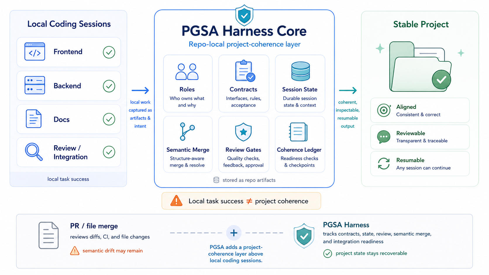
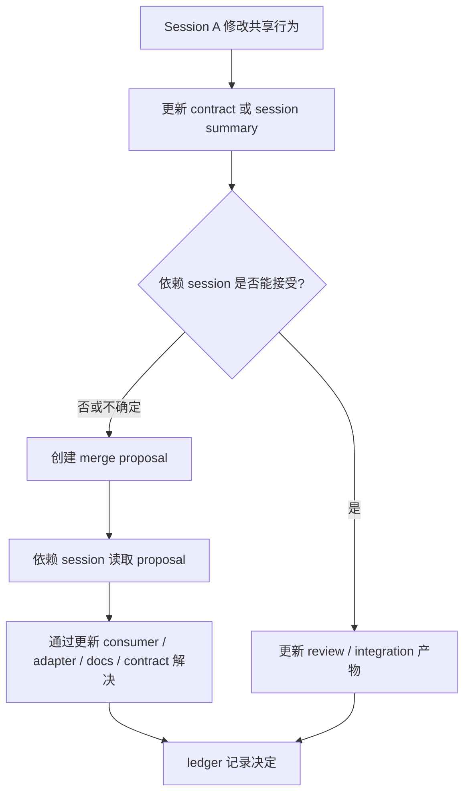

# PGSA Harness Core

PGSA Harness Core 是一个面向 coding-agent 工作流的**仓库本地项目一致性层**。

它是 harness-first、file-first 的。它不在模型内部运行。它存在于代码仓库里。

Codex-style、Claude Code-style、Grok Build-style 和 generic CLI agents 可以读取它、写入它，并把它用作 contracts、session summaries、semantic merge proposals、review state、integration reports、coherence ledger events 和 drift reports 的工作流层。

主要协议表面是 `AGENTS.md`、`.codex/`、`.agents/skills/`、`skills/`、`commands/`、`hooks/`、`templates/`、`rules/`，以及目标仓库里的 `pgsa/` 产物。Python CLI 是可选 helper automation，不是协议本体。



PGSA 不替代 PR 或 worktree。它在长期 coding-agent session 之间增加一个仓库本地的项目一致性层。

目标仓库里的 `pgsa/` 文件夹包含可读、可 diff、可审查的项目产物：

- session harness 文件；
- contracts；
- session summaries；
- semantic merge proposals；
- review gates；
- integration reports；
- coherence ledger events；
- drift reports。

Python 代码只负责初始化、校验、打包和总结这些仓库本地产物。协议本体仍然体现在 Markdown、JSON、YAML 形态文件和 JSONL ledger 中。

PGSA Harness Core v0.1 是实验性版本。它不是 Codex、Claude Code、Grok、OpenAI、Anthropic 或任何托管产品的基准测试。

## 核心思想

coding agent 可以完成局部任务，但项目整体仍然发生漂移。

例如：backend session 修改了 API，frontend session 仍然保留旧假设；docs 还描述旧行为；局部检查通过，但最终集成时项目已经对不上。

PGSA 的作用是在下一个 session 需要从记忆里重建项目状态之前，把共享项目状态显式写进仓库。

核心句子：

```text
PGSA Harness 不在 Codex 内部。它在仓库内部。Codex 读取它、写入它，并将其用作项目一致性工作流层。
```

## 会创建什么

`pgsa init` 会在目标仓库中创建这层协议：

```text
pgsa/
  project.yaml
  sessions.yaml
  harness/
    backend.md
    frontend_components.md
    docs_security_integration.md
  contracts/
    api.project.v1.json
  state/
    backend.summary.md
    frontend_components.summary.md
    docs_security_integration.summary.md
  merge_proposals/
  reviews/
  integration/
    integration_report.json
  ledger/
    coherence_ledger.jsonl
  reports/
```

最重要的是 `pgsa/harness/` 下的 session harness 文件。它们告诉每个 session 自己负责什么、必须更新什么、如何记录冲突。

## 仓库结构

这个 repo 现在按 agent harness 仓库组织，而不只是 Python CLI package：

- `AGENTS.md`：给 coding agents 的仓库级工作规则。
- `.codex/`：Codex-style workflow 说明、prompt 和示例。
- `.claude/`：Claude Code-style workflow 说明、command notes 和 hook notes。
- `.opencode/`：generic/OpenCode-style workflow 说明。
- `.agents/skills/pgsa/`：runtime-neutral PGSA skill。
- `skills/`：Codex-style 和 Claude Code-style 的 tool-specific skill bundles。
- `adapters/`：Codex、Claude Code、Grok Build 和 generic CLI 的 adapter notes。
- `commands/`：session start、contract update、merge proposal、review gate、integration check、drift report 的 command-style prompts。
- `hooks/`：session start、post tool use、stop check 生命周期 hook 示例；默认不自动启用。
- `templates/`：会进入目标仓库 `pgsa/` 层的公开 artifact 模板。
- `rules/`：给 agent 快速读取的声明边界和工作流边界。
- `roles/`：项目自定义 role 示例和 schema；示例 role 不是 PGSA 的固定要求。
- `assets/`：README 和发布材料使用的公开图片。
- `scripts/`：安装、smoke test、release validation 和 packaging helper。
- `pgsa_cli/`：可选 Python CLI 入口。
- `core/`：schemas、templates、validators、metrics 和 context export 实现。
- `examples/`：轻量 PGSA artifact 示例项目。
- `tests/`：基于标准库的 CLI 和示例项目 smoke tests。
- `docs/`：架构、生命周期、概念、证据和声明边界文档。

## Session 之间如何交流

PGSA 不要求两个 agent 直接互相聊天。

交流机制是仓库本身：

1. `pgsa/sessions.yaml` 定义稳定的 session 职责边界。
2. `pgsa/harness/<session>.md` 给每个 session 操作指令。
3. `pgsa/contracts/*.json` 记录共享 API、schema、组件、权限或文档约定。
4. `pgsa/state/*.summary.md` 记录每个 session 改了什么、它认为哪些事情成立。
5. `pgsa/merge_proposals/*.md` 记录 session 之间的语义冲突。
6. `pgsa/reviews/` 和 `pgsa/integration/` 记录依赖区域是否接受了改动。
7. `pgsa/ledger/coherence_ledger.jsonl` 给项目留下 append-only 的项目一致性记忆。

这就是冲突解决的关键：当某个 session 改变共享假设时，它必须更新 contract，或创建 merge proposal。下一个 session 读取这些仓库本地产物，而不是依赖上一段聊天记录。



## 为什么要导出 Session Context

`export-context` 不是 session 之间的交流机制。真正的交流机制是 `pgsa/` 产物层。

`export-context` 只是一个便利命令：它把相关 session harness、contracts、summary、最近 ledger events 和当前 drift report 组合成一个 Markdown 包，方便 agent 启动时一次性读取正确的项目状态。

你也可以不使用 `export-context`，直接手动读取这些文件。协议仍然成立。

## Roles 和 Sessions

PGSA 的 role 是项目自定义的。示例里的 frontend、backend、docs、security 只是 starter vocabulary，不是固定要求。

项目可以在 `roles/` 下定义自己的 role，在 `pgsa/sessions.yaml` 中绑定成具体 session，并连接到 Codex、Claude Code 或 generic agent 工作流。

## PGSA、PR 和 Worktree

PGSA 不是 PR 替代品，也不是 worktree 替代品。

```text
PR 问：这个 diff 能合并吗？
PGSA 问：多个 session 修改之后，项目整体是否仍然说得通？
```

PGSA 可以在 PR/worktree 工作流之前、期间或之上运行。

## 快速开始

如果你的系统没有 `python` 命令别名，请把下面命令里的 `python` 替换成 `python3`。

```bash
mkdir demo-project
python -m pgsa_cli.main --root demo-project init
python -m pgsa_cli.main --root demo-project validate
python -m pgsa_cli.main --root demo-project drift-report
python -m pgsa_cli.main --root demo-project harness --session backend
python -m pgsa_cli.main --root demo-project export-context --session backend --output backend_context.md
```

安装 CLI 后：

```bash
python -m venv .venv
python -m pip install -e .
pgsa --root demo-project validate
pgsa --root demo-project drift-report
```

## 命令

- `init`：创建仓库本地 PGSA 产物层。
- `validate`：检查必须存在的产物和明显结构问题。
- `drift-report`：写入 `pgsa/reports/drift_report.json`。
- `watch`：执行一次性 status check；它不是后台 supervisor。
- `queue list`：读取可选的 `pgsa/tasks/queue.json`；queue 不是 session 交流机制。
- `harness --session <name>`：打印某个 session 的 harness Markdown。
- `export-context --session <name>`：打印或写入某个 session 的 context 包。
- `continuation-prompt --session <name>`：根据当前 drift 生成继续处理提示。
- `session start/update`：追加 session 生命周期事件并更新 summary。
- `contract diff`：显示 contract 相关校验问题。
- `integration check`：显示 integration blocker。
- `merge propose`：创建语义合并提案。

## Agent Harness 入口

- Codex-style workflow：读取 `.codex/README.md` 和 `skills/codex/SKILL.md`。
- Runtime-neutral workflow：读取 `.agents/skills/pgsa/SKILL.md`。
- Claude Code-style workflow：读取 `skills/claude-code/SKILL.md`。
- Command-style workflow：使用 `commands/` 里的 prompts。
- Hook-style workflow：只有在用户明确配置时，才改造 `hooks/` 里的 examples。

## 为什么还保留 Python 文件

协议本体是 `pgsa/` 产物。

Python 文件是 helper automation：

- `pgsa_cli/main.py`：`python -m pgsa_cli.main` 的入口。
- `pgsa_cli/cli.py`：把 `init`、`validate`、`harness`、`export-context`、`drift-report`、`watch`、`queue list` 等命令连到下面的核心函数。
- `core/io.py`：读写 JSON / JSONL / JSON-compatible YAML 文件。
- `core/templates/defaults.py`：内置默认 project、sessions、contract、summary、harness、review、integration 模板数据。
- `core/templates/initializer.py`：执行 `pgsa init`，在目标仓库创建 `pgsa/` 文件夹和默认产物。
- `core/validators/artifacts.py`：执行 `pgsa validate`，检查必要产物、contract shape、未解决 merge proposal、integration blocker。
- `core/metrics/drift.py`：执行 `pgsa drift-report`，根据校验结果生成 drift / maintainability 报告。
- `core/supervisor/context.py`：读取 `pgsa/harness/<session>.md`，并可选导出单个 session 的 context 包。
- `scripts/*.py`：release 和本地采用 helper scripts。
- `tests/*.py`：标准库 smoke tests。
- 各级 `__init__.py`：只负责让这些文件夹成为可导入的 Python package。

用户不需要编辑这些 Python 文件。用户真正使用的是生成出来的 Markdown/JSON/YAML 产物。

换句话说：Python 不是新的使用门槛，它只是把手工创建和检查 `pgsa/` 产物这件事自动化。最小手工用法仍然可以是直接读写 `pgsa/harness/*.md`、`pgsa/contracts/*.json`、`pgsa/state/*.summary.md` 和 `pgsa/merge_proposals/*.md`。

## FAQ

### PGSA 的角色是固定的吗？

不是。角色是项目自定义的。示例里的 frontend/backend/docs/security 只是例子，不是 PGSA 的硬编码要求。

### PGSA 只是 PR 吗？

不是。PR 主要审查 code diff。PGSA 记录跨 session 的项目状态事务：contracts、session state、semantic conflicts、review state 和 integration readiness。

### PGSA 只是 Git worktree / GitTree 吗？

不是。Worktree 隔离执行环境。PGSA 跟踪跨 session 的项目一致性。

### PGSA 会自动解决所有冲突吗？

不会。PGSA 把隐藏的项目冲突变成明确、可审查、可恢复的 artifacts。

### CLI 到底做什么？

CLI 负责初始化、校验、导出和总结 artifacts。它是 helper automation，不是语义权威。

### Subagents 如何进入 PGSA？

Subagents 在 session 内部工作。session owner 或 Session Master 把它们的输出综合成项目级 PGSA artifacts。PGSA v0.1 会建模这种交接关系，但不提供 runtime subagent scheduler。

### 什么时候 PGSA 太重？

单文件小改、一次性脚本、孤立实验、没有跨 session 风险的任务，一般不需要 PGSA。

## 证据边界

当前证据只是本地 generated git-worktree architecture-protocol evidence。

支持的窄声明是：

```text
在本地 generated git-worktree suites 中，PGSA-gated artifacts 能把 semantic contract drift 显示为 review / merge blockers，且没有 over-block included no-drift controls。
```

这不是 Codex / Claude / Grok 产品级 benchmark。

产品级声明需要真实工具命令、prompts、transcripts、diffs、tests、timing、versions 和同一个 evaluator。
